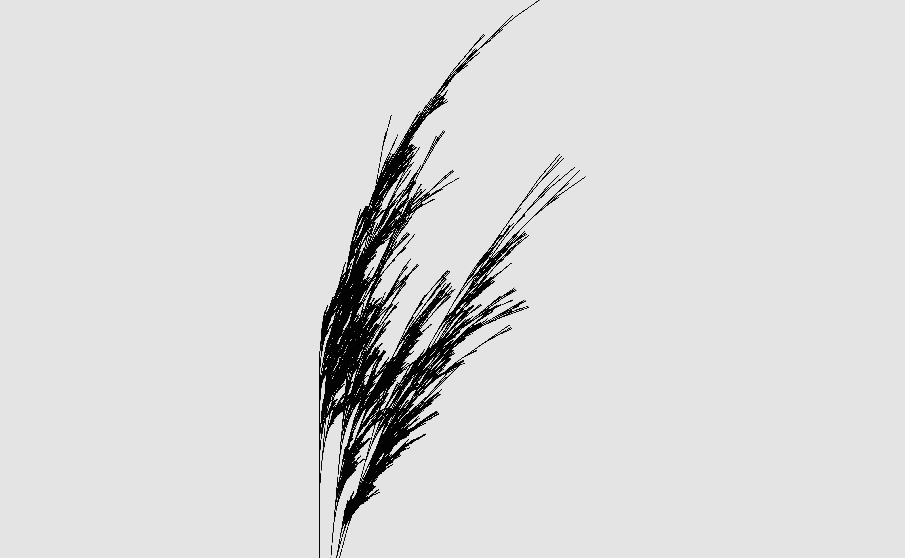

The sixth section is also an [art class](functionality), this time focused on writing functions and using the functional programming toolkit in the purrr package. At the beginning the focus is on material for beginners: how to write a function and what the parts of a function are. Through the middle sections the discussion looks at how to write the functions necessary to make the "ashtree" system work, and how to organise those functions in a sensible way. The final sections provide an (minimal) introduction to purrr, and a (very) cursory discussion of scoping rules in R. Also it makes art!

#### Resources:
- [R markdown slides](functionality)
- [YouTube playlist](https://www.youtube.com/playlist?list=PLRPB0ZzEYegPHHji3tBw2U4yp-DxMrUkB)
- [RStudio cloud project 1169065](https://rstudio.cloud/project/1169065)
- [GitHub repository for ashtree](https://github.com/djnavarro/ashtree)
- [GitHub repository for flametree](https://github.com/djnavarro/flametree)

