```{r setup, include=FALSE}
options(htmltools.dir.version = FALSE)
```


class: split-60 bg-main1

.column.bg-main1[.content.vmiddle.center[

# What? Why? How?

.pull.left[.pad1[
.font2[
- .orange[**What?**] Version control, collaboration, back up
- .orange[**Why?**] Everyone has a laptop fire one day
- .orange[**How?**] No-one really knows.
]]]

]]

--
.column.bg-main3[.content.vmiddle.center[


]]


<!-- *********** NEW SLIDE ************** -->
---
class: split-60 bg-main1

.column.bg-main1[.content.vmiddle.center[

# Structure of this section

.pull.left[.pad1[
.font2[
- This is interactive: don't just listen, code!
- Slide structure mirrors the tutorial:
- https://djnavarro.github.io/chdss2018/git.html
- Goal is to build a repository that we'll use later
]]]

]]

.column.bg-main3[.content.vmiddle.center[


]]


<!-- *********** NEW SLIDE ************** -->
---

class: bg-main1 center middle hide-slide-number

.reveal-text.bg-main2[.pad1[
.font4[Installing git]
]]


<!-- *********** NEW SLIDE ************** -->
---
class: split-two bg-main1

.column.bg-main1[.content.vmiddle.center[

# How to install

<br>

.pull.left[.pad1[

### Windows users:
### https://gitforwindows.org/
<br>
### Mac users:
### Install Xcode from App Store (warning: 6Gb)


]]

]]

.column.bg-main3[.content.vmiddle.center[

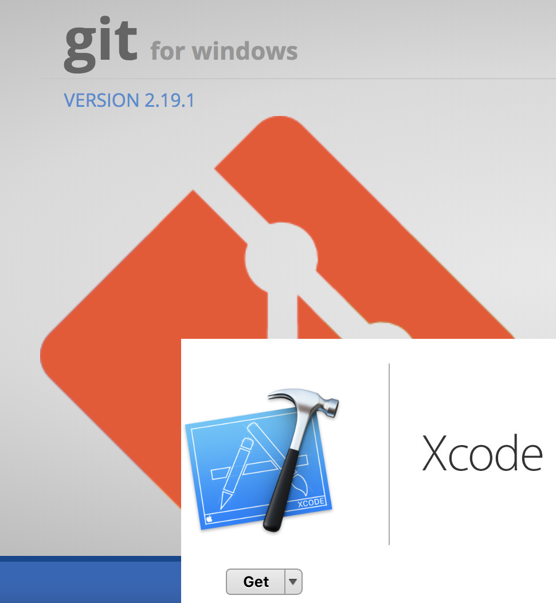

]]


<!-- *********** NEW SLIDE ************** -->
---
class: split-two bg-main1

.column.bg-main1[.content.vmiddle.center[

# How to install

<br>

.pull.left[.pad1[

### Windows users:
### https://gitforwindows.org/
<br>
### Mac users:
### Install Xcode from App Store (warning: 6Gb)


]]

]]

.column.bg-main1[.content.vmiddle.center[

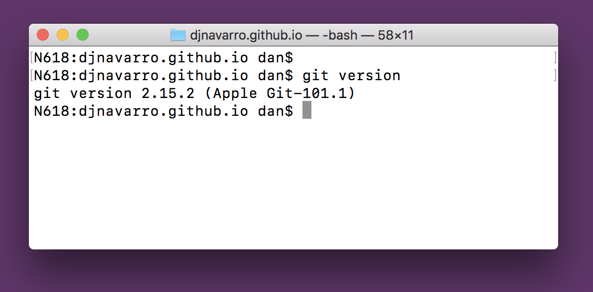

]]


<!-- *********** NEW SLIDE ************** -->
---

class: bg-main1 center middle hide-slide-number

.reveal-text.bg-main2[.pad1[
.font4[Configuring git]
]]


<!-- *********** NEW SLIDE ************** -->
---

class: bg-main1

.pad2[
.font3[Configuring git]
.pull.left[.font2[
- Git (& later, GitHub) needs to know your name and email
- Choose wisely! GitHub has educational discounts
- From the Windows command prompt / Mac terminal:
]
```{}
git config --global user.name 'Danielle Navarro'
git config --global user.email 'd.navarro@unsw.edu.au'
```
]]
--
.pad2[.pull.left[.font2[
- Other configurable things:
]
```{}
git config --list
```
]]


<!-- *********** NEW SLIDE ************** -->
---

class: bg-main1 center middle hide-slide-number

.reveal-text.bg-main2[.pad1[
.font4[Get a GitHub account]
]]


<!-- *********** NEW SLIDE ************** -->
---
class: split-two bg-main1

.column.bg-main1[.content.vmiddle.center[

# Get a GitHub account

<br>

.pull.left[.pad1[

### https://github.com/
### GitHub will host repositories for you
### Allows proper version control 
### Ideal for collaborative coding

]]

]]

.column.bg-main3[.content.vmiddle.center[

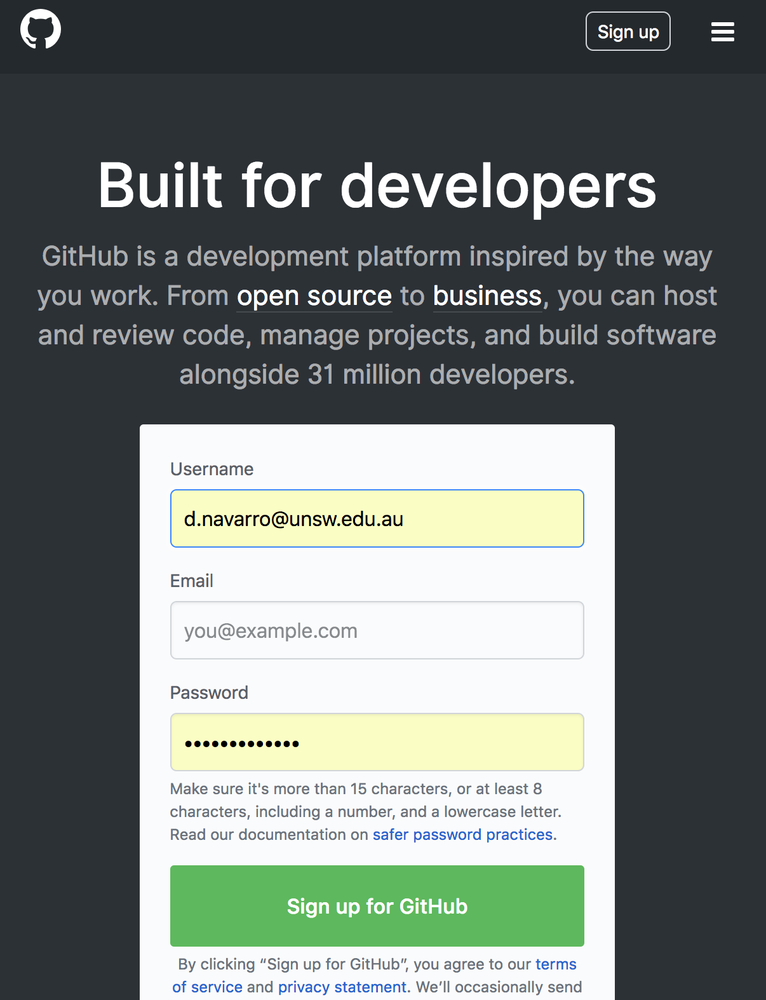

]]


<!-- *********** NEW SLIDE ************** -->
---

class: bg-main1 center middle hide-slide-number

.reveal-text.bg-main2[.pad1[
.font4[Creating a repository on GitHub]
]]


<!-- *********** NEW SLIDE ************** -->
---
class: split-two bg-main1

.column.bg-main1[.content.vmiddle.center[

# How to create a repo

<br>

.pull.left[.pad1[

### Select new repository (The + in the top right)
### Fill out details (See adjacent panel)
### Celebrate! (See notes for extras)

]]

]]

.column.bg-main3[.content.vmiddle.center[

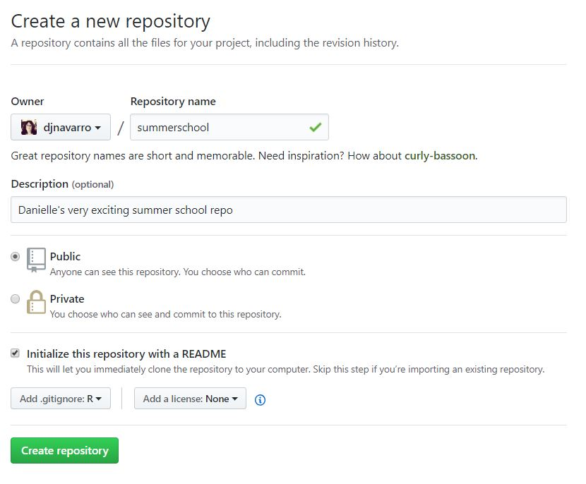

]]


<!-- *********** NEW SLIDE ************** -->
---

class: bg-main1 center middle hide-slide-number

.reveal-text.bg-main2[.pad1[
.font4[Clone to your local machine]
]]


<!-- *********** NEW SLIDE ************** -->
---
class: split-two bg-main1

.row.bg-main1[.content.vmiddle.center[

# At the Windows Command Prompt

.pull.left[.pad1[
```{}
cd C:\Users\Dan\GitHub
git clone https://github.com/YOURUSERNAME/summerschool.git
```
]]
]]

--

.row.bg-main3[.content.vmiddle.center[

# At the Mac OS Terminal

.pull.left[.pad1[
```{}
cd /Users/Dan/GitHub
git clone https://github.com/YOURUSERNAME/summerschool.git
```

]]
]]


<!-- *********** NEW SLIDE ************** -->
---

class: bg-main1 center middle

# The result is a local copy of the repository 
<br>
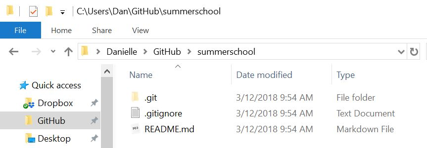
<br>


<!-- *********** NEW SLIDE ************** -->
---

class: bg-main1 center middle hide-slide-number

.reveal-text.bg-main2[.pad1[
.font4[Learning about your repository]
]]


<!-- *********** NEW SLIDE ************** -->
---
class: split-60 bg-main1

.column.bg-main1[.content.vmiddle.center[

# How do you feel?

.pull.left[.pad1[
```{}
git status
```
```{}
On branch master
Your branch is up to date with 'origin/master'.

nothing to commit, working tree clean
```
]]
]]

--
.column.bg-main1[.content.vmiddle.center[

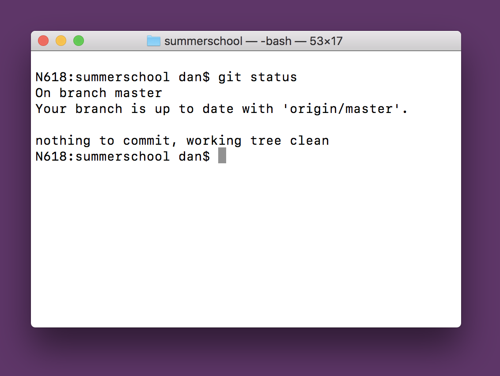

]]


<!-- *********** NEW SLIDE ************** -->
---
class: split-70 bg-main1

.column.bg-main1[.content.vmiddle.center[

# Where is your home?

.pull.left[.pad1[
```{}
git remote --verbose
```
```{}
origin  https://github.com/djnavarro/summerschool.git (fetch)
origin  https://github.com/djnavarro/summerschool.git (push)
```
]]
]]

--
.column.bg-main3[.content.vmiddle.center[


]]


<!-- *********** NEW SLIDE ************** -->
---

class: bg-main1 center middle hide-slide-number

.reveal-text.bg-main2[.pad1[
.font4[Making local changes]
]]


<!-- *********** NEW SLIDE ************** -->
---

class: bg-main1 center middle

# Let's open the README.md file in RStudio 

<br>
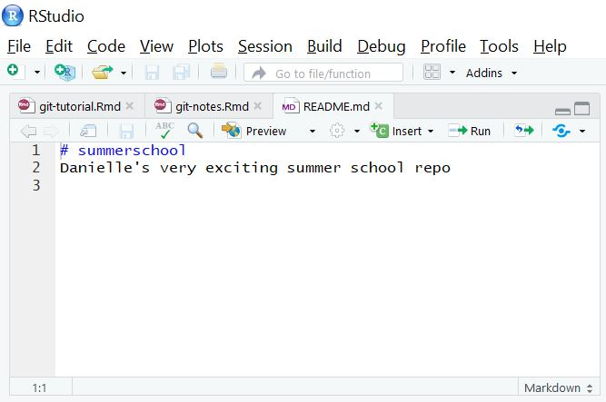
<br>


<!-- *********** NEW SLIDE ************** -->
---
class: split-two bg-main3

.column.bg-main3[.content.vmiddle.center[

# Edit the file...

<br>
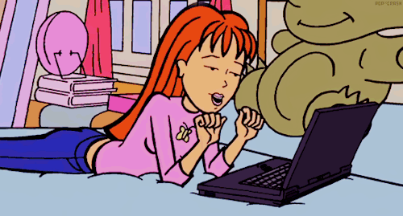
<br>

]]
]]

--
.column.bg-main1[.content.vmiddle.center[

.pull.left[.pad1[.font2[
- Suggestion... take a look at what I did
- The .md file is written using "markdown"
- We'll use markdown for documents later!
]]]

.pull.left[.pad1[.font2[
Illustration:
- This is the [raw markdown](https://raw.githubusercontent.com/djnavarro/summerschool/master/README.md)
- This is the [rendered markdown](https://github.com/djnavarro/summerschool/blob/master/README.md)
]]]

]]


<!-- *********** NEW SLIDE ************** -->
---

class: bg-main1 split-two

.column[

]

.column[

]


<!-- *********** NEW SLIDE ************** -->
---

class: bg-main1 center middle

# Click the preview button...

<br>
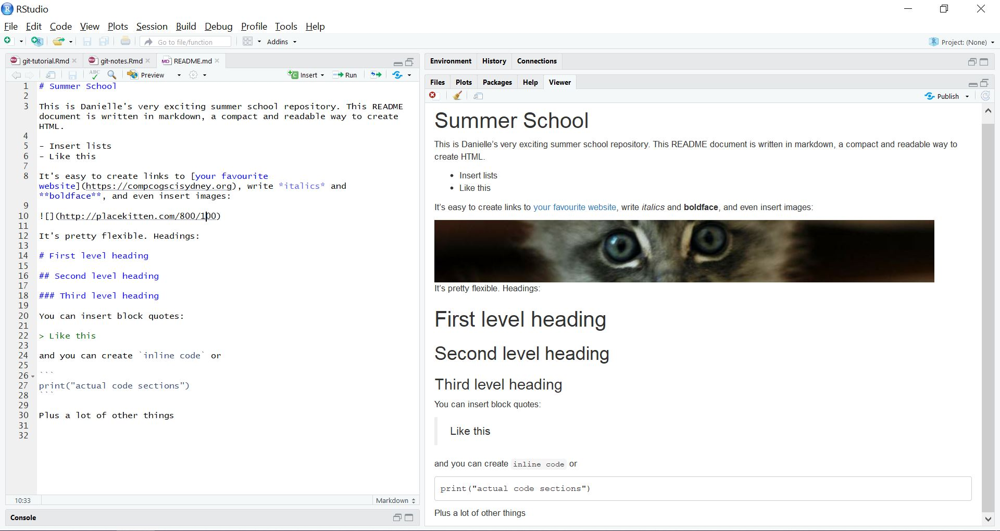
<br>


<!-- *********** NEW SLIDE ************** -->
---

class: bg-main1 center middle hide-slide-number

.reveal-text.bg-main2[.pad1[
.font4[Making a local commit]
]]


<!-- *********** NEW SLIDE ************** -->
---

class: split-two bg-main1

.column.bg-main1[.content.vmiddle.center[

.pull.left[.pad1[

.font2[It's a "simple" three-step process...]
.font2[
- check the status
- add (stage) the changes
- commit the changes
]
```{}
git status
git add --all
git commit -m "YOUR MESSAGE HERE"
```
.font2[... see [the tutorial](https://djnavarro.github.io/chdss2018/git.html) for details]
]]
]]

--
.column.bg-main3[.content.vmiddle.center[


]]


<!-- *********** NEW SLIDE ************** -->
---

class: bg-main1 center middle hide-slide-number

.reveal-text.bg-main2[.pad1[
.font4[Pushing your commits to GitHub]
]]


<!-- *********** NEW SLIDE ************** -->
---

class: split-two bg-main1

.column.bg-main1[.content.vmiddle.center[

.pull.left[.pad1[

.font2[Pushing your changes to GitHub]

```{}
git push -u origin master
```

]]
]]

--

.column.bg-main3[.content.vmiddle.center[

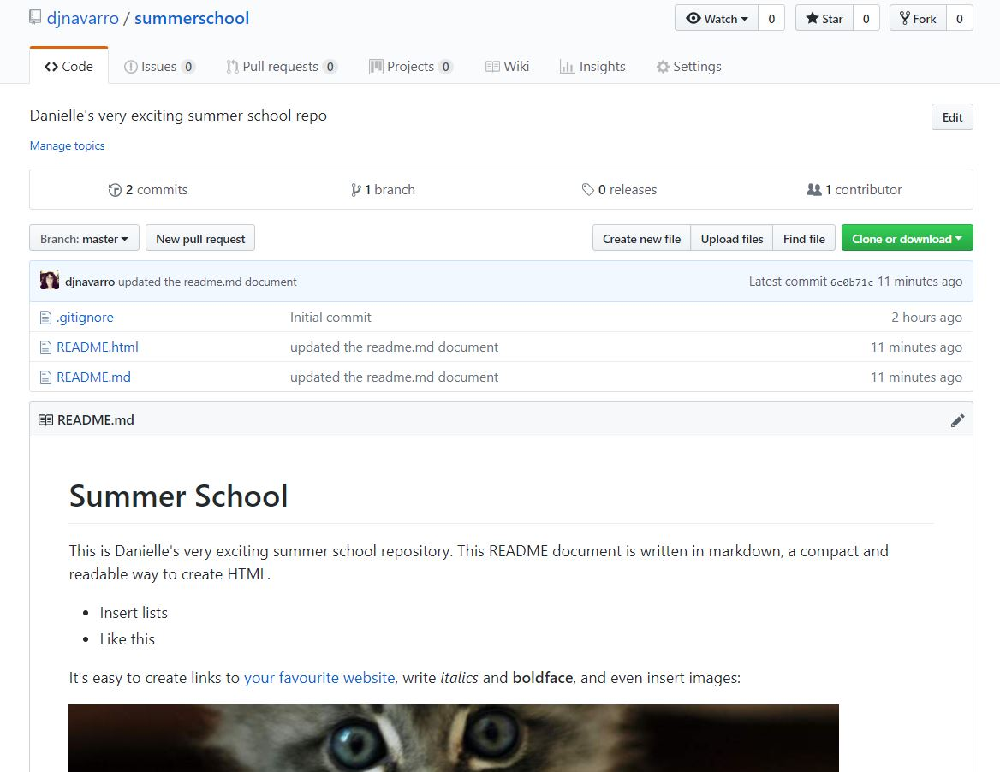

]]


<!-- *********** NEW SLIDE ************** -->
---

class: split-two bg-main1

.column.bg-main1[.content.vmiddle.center[

## .orange[Skills learned so far?]

.pull.left[.pad1[.font2[
- Creating a git repository
- Making changes and commiting them
- Pushing changes to GitHub
]]]

## .orange[What does this buy us?]

.pull.left[.pad1[.font2[
- Backing up files on GitHub
- Sharing code with public repositories
- Transparency: git commits leave trails
]]]

]]

--

.column.bg-main3[.content.vmiddle.center[

## Is that all? Really?


]]


<!-- *********** NEW SLIDE ************** -->
---

class: bg-main1 center middle hide-slide-number

.reveal-text.bg-main2[.pad1[
.font4[Collaboration via GitHub]
]]


<!-- *********** NEW SLIDE ************** -->
---

class: bg-main1 center middle

# To add a collaborator on GitHub

<br>
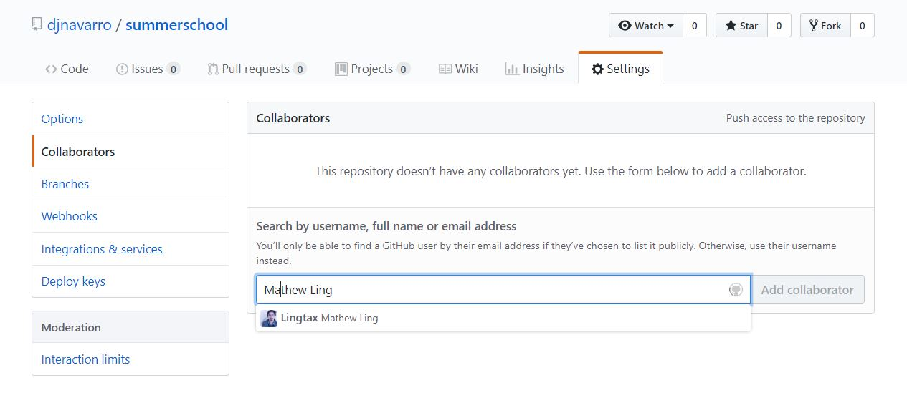
<br>


<!-- *********** NEW SLIDE ************** -->
---

class: split-two bg-main1

.column.bg-main1[.content.vmiddle.center[

# Collaborators can work on it too...

.pull.left[.font2[.pad1[
- Try it: invite someone and have them
- Clone your repo
- Commit some changes 
- Push up to GitHub
]]]
]]
--
.column.bg-main3[.content.vmiddle.center[

# How do you get their changes?

.pull.left[.pad1[.font2[
```{}
git pull
```
]]]
]]


<!-- *********** NEW SLIDE ************** -->
---

class: split-two bg-main1

.column.bg-main1[.content.vmiddle.center[

# You can work simultaneously

.pull.left[.font2[.pad1[
- If you're not editing the same thing
- Make local commits whenever you like
- Remember to pull before you push!
]]]
]]
--
.column.bg-main3[.content.vmiddle.center[

# But beware... of merge conflicts 


<!---->

]]

<!-- *********** NEW SLIDE ************** -->
---

class: bg-main1 center middle hide-slide-number

.reveal-text.bg-main2[.pad1[
.font4[The pay off!]
]]


<!-- *********** NEW SLIDE ************** -->
---

class: bg-main1 center middle

# You can code together with many people...

<br>
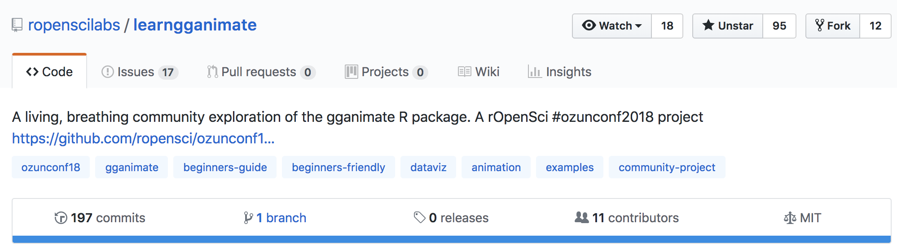
<br>


<!-- *********** NEW SLIDE ************** -->
---

class: bg-main1 center middle

<br>

<br>


<!-- *********** NEW SLIDE ************** -->
---

class: bg-main1 center middle

# Collaborative coding can be pretty!

<br>

<br>


<!-- *********** NEW SLIDE ************** -->
---

class: bg-main1 center middle

# Or fabulously absurd!

<br>

<br>


<!-- DONE -->
---

class: bg-main1 middle center

## thank u, next


