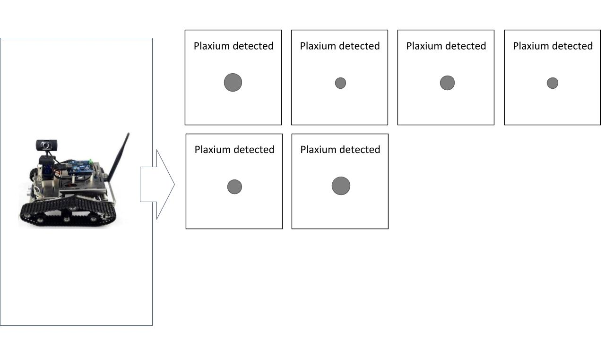
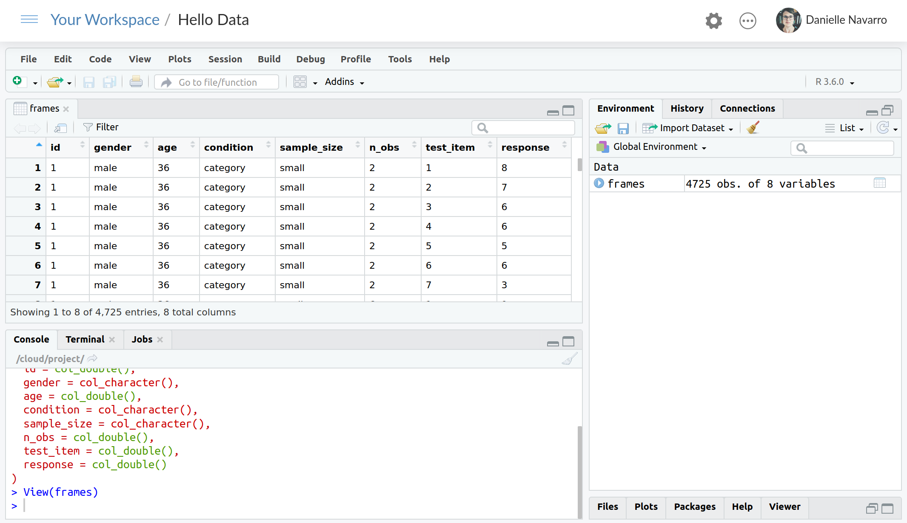

```{r child = "../style/setup.Rmd"}
```


```{r meta, echo=FALSE}
library(metathis)
meta() %>%
  meta_general(
    description = "Importing, piping and exporting data in R",
  ) %>% 
  meta_name("github-repo" = "djnavarro/robust-tools") %>% 
  meta_social(
    title = "Say hello to your data",
    url = "https://robust-tools.djnavarro.net/hello/",
    image = "https://robust-tools.djnavarro.net/hello/img/pipe.png",
    image_alt = "Text showing the magrittr pipe in R, written as %>%, overlaying a greyscale image of industrial pipes",
    og_type = "website",
    og_author = "Danielle Navarro",
    twitter_card_type = "summary_large_image",
    twitter_creator = "@djnavarro"
  )
```

```{r load-packages, message=FALSE, echo=FALSE}
library(countdown)
library(tidyverse)
```

```{r include=FALSE}
hook_source <- knitr::knit_hooks$get('source')
knitr::knit_hooks$set(source = function(x, options) {
  x <- stringr::str_replace(x, "^[[:blank:]]?([^*].+?)[[:blank:]]*#<<[[:blank:]]*$", "*\\1")
  hook_source(x, options)
})
```


class: middle

background-image: url("img/thinking_skeleton.jpg")
background-size: cover

.pull-left-narrow[
  .huge-blue-number[1]
]
.pull-right-wide[
  .larger[
  `r emo::ji("woman_scientist")`
  ]
]

---


class:middle

.pull-left[
```{r summary.plot, echo=FALSE, warning=FALSE, message = FALSE, fig.height=6}
frames <- read_csv("data_reasoning.csv") %>%
  mutate(
    sample_size = factor(sample_size, levels = c("small", "medium", "large")),
    test_item = factor(test_item)
  ) 
ggplot(frames, aes(x = test_item, y = response)) +
  geom_boxplot(aes(fill = test_item), outlier.alpha = 0, coef = 0, show.legend = FALSE) +
  facet_grid(rows = vars(sample_size), cols = vars(condition)) + 
  scale_y_continuous(breaks = 0:9, minor_breaks = NULL) + 
  scale_fill_viridis_d(alpha = .5) + 
  theme_minimal() 
```
]

.pull-right[
<br><br>
Hayes, Banner, Forrester & Navarro (2019). 
<br><br>
*Selective sampling and inductive inference: Drawing inferences based on observed and missing evidence* <br><br>
https://psyarxiv.com/2m83v/ 
]

---


class: middle

### https://robust-tools.djnavarro.net/reasoning/

```{r, echo=FALSE}
knitr::include_graphics("img/robot1.jpg", dpi = 72)
```


---

class: middle

.hand[Property sampling: the robot only detects plaxium spheres]
```{r, echo=FALSE}
knitr::include_graphics("img/data10_property.jpg")
```


---

class: middle
.hand[Category sampling: the robot only tests small spheres]
```{r, echo=FALSE}
knitr::include_graphics("img/data10_category.jpg")
```


---

class: middle
.hand[Small sample size: Elicit judgments after two observations]
```{r, echo=FALSE}
knitr::include_graphics("img/data2_property.jpg")
```

---

class: middle
.hand[Medium sample size: Elicit judgments after six observations]
```{r, echo=FALSE}

```

---

class: middle
.hand[Large sample size: Elicit judgments after twelve observations]
```{r, echo=FALSE}
knitr::include_graphics("img/data12_property.jpg")
```


---

class: middle
.hand[Seven test items that vary in size: Smallest...]
```{r, echo=FALSE}
knitr::include_graphics("img/test2.jpg")
```

---

class: middle
.hand[Seven test items that vary in size: Largest...]
```{r, echo=FALSE}
knitr::include_graphics("img/test8.jpg")
```


---

class: middle

.pull-left[
```{r, ref.label="summary.plot", echo=FALSE, warning=FALSE, message = FALSE, fig.height=6}
```
]

.pull-right[
<br><br>
- smooth generalisation profiles
- similar for small samples
- different for large samples
<br><br>
- property shows "tightening"
- category does not
]

---

class: middle

background-image: url("img/thinking_skeleton.jpg")
background-size: cover

.pull-left[
```{r, ref.label="summary.plot", echo=FALSE, warning=FALSE, message = FALSE, fig.height=6}
```
]

.pull-right[
<br><br><br>
<br><br><br>
<br>

.hand[
<p style="text-align:right">Exercise #1:<br>discuss this study!</p>
]

```{r echo=FALSE}
countdown(minutes = 1, color_background = "white")
```
]


---

class: middle, inverse

background-image: url("img/bookshelves.jpg")
background-size: cover


.pull-left-narrow[
  .huge-blue-number[2]
]
.pull-right-wide[
  .larger[
  &nbsp; `r emo::ji('book')` <br>
  &nbsp; <span style="color:white;font-weight: bold">Reading</span><br>
  &nbsp; <span style="color:white;font-weight: bold">your data</span>
  ]
]


---

class: middle, inverse

## https://rstudio.cloud/project/978818

---

class: inverse
.hand[Reading the data into R]

```{r read-data, warning=FALSE, message=FALSE}
library(tidyverse)
frames <- read_csv(file = "data_reasoning.csv")
```
--
```{r ref.label="read-data", echo=FALSE, warning=FALSE}
```


---

class: inverse
.hand[Click on "frames" in the environment pane]
```{r, echo=FALSE, out.width=900}
knitr::include_graphics("img/view_frames_0.png")
```


---

class: inverse
.hand[Click on "frames" in the environment pane]
```{r, echo=FALSE, out.width=900}

```


---

class: inverse
.hand[Inspecting the data]
```{r print-data, warning=FALSE, message=FALSE, results='hide'}
print(frames)
```
--
```{r, echo=FALSE, warning=FALSE}
print(frames, n = 6, width = 59)
```


---

class: inverse
.hand[Inspecting the data]
```{r glimpse-data, warning=FALSE, message=FALSE, results='hide'}
glimpse(frames)
```
--
```{r, echo=FALSE, warning=FALSE}
glimpse(frames, width = 59)
```

---

background-image: url("img/bookshelves.jpg")
background-size: cover

class: middle
.hand[<span style="color:white;font-weight: bold;font-size:64pt">Exercise #2</span>]

---

class: middle, inverse

background-image: url("img/pipes.jpg")
background-size: cover

.pull-left-narrow[
  .huge-blue-number[3]
]
.pull-right-wide[
  .larger[
  &nbsp;The pipe<br>
  &nbsp;.embolden[%&gt;%]<br>
  ]
]


---

background-image: url("img/pipes2.jpg")
background-size: cover

<br><br><br>
.hand[The pipe, %>%]

.pull-left[
- Take the frames data...
- Do one thing...
- Then another...
- And then one more...
]
--
.pull-right[
```{}
frames %>%
  do_one_thing(.) %>%
  then_another(.) %>%
  and_then_one_more(.)
```
]


---

background-image: url("img/pipes2.jpg")
background-size: cover

class: middle

.pull-left-wide[
```{}
data %>% 
  tidy() %>%
  describe() %>%
  visualise() %>%
  analyse()
```

- We "pipe" our data through operations
- The data set *flows* through our analysis
]

---

background-image: url("img/pipes2.jpg")
background-size: cover

class: middle
.hand[<span style="font-weight: bold;font-size:64pt">Exercise #3</span>]

---

class: middle, inverse

background-image: url("img/drawers.jpg")
background-size: cover


.pull-left-narrow[
  .huge-blue-number[4]
]
.pull-right-wide[
  .larger[.embolden[.plainwhite[
    &nbsp; Grouped<br>
    &nbsp; summary
  ]]]
]

---

class: middle, inverse 

background-image: url("img/drawer2.jpg")
background-size: cover

.pull-left-wide[
.hand[The basic idea]

```{r, eval=FALSE}
frames %>%
  group_by( GROUP ) %>%
  summarise( EXPRESSION ) %>%
  ungroup()
```

- use `group_by` to define groups
- use `summarise` to... summarise
- use `ungroup` to remove grouping
]


---
class: inverse

background-image: url("img/drawer2.jpg")
background-size: cover

.hand[Group, summarise...]

```{r frames-group, results='hide'}
frames %>%
  group_by(test_item, sample_size, n_obs, condition) %>%
  summarise(response = mean(response))
```
--
```{r, echo=FALSE, highlight.output=2:3}
frames %>%
  group_by(test_item, sample_size, n_obs, condition) %>%
  summarise(response = mean(response)) %>%
  print(n = 4)
```


---
class: inverse

background-image: url("img/drawer2.jpg")
background-size: cover

.hand[Group, summarise, and ungroup]

```{r frames-group-2, results='hide'}
frames %>%
  group_by(test_item, sample_size, n_obs, condition) %>%
  summarise(response = mean(response)) %>%
  ungroup() #<<
```

```{r, echo=FALSE, highlight.output=2}
frames %>%
  group_by(test_item, sample_size, n_obs, condition) %>%
  summarise(response = mean(response)) %>%
  ungroup() %>%
  print(n = 4)
```

---
class: inverse

background-image: url("img/drawer2.jpg")
background-size: cover

.hand[A more realistic example]
.pull-left[
```{r summarise-real, results='hide'}
frames %>% 
  group_by(test_item) %>%
  summarise(
    m = mean(response), #<<
    s = sd(response), #<<
    n = n() #<<
  ) %>%
  ungroup()
```
]
--
.pull-right[
```{r ref.label="summarise-real", echo=FALSE}
```
]

???
- these are bad variable names
- i've done it to fit the slides
- don't do it in real life


---
class: inverse

background-image: url("img/drawer2.jpg")
background-size: cover

.hand[A more realistic example]
.pull-left[
```{r summarise-var, results='hide'}
by_item <- frames %>% #<<
  group_by(test_item) %>%
  summarise(
    m = mean(response), 
    s = sd(response), 
    n = n() 
  ) %>%
  ungroup()
```
]

---
class: inverse

background-image: url("img/drawer2.jpg")
background-size: cover

.hand[A more realistic example]
.pull-left[
```{r summarise-plot, results='hide', fig.show='hide'}
ggplot(
  data = by_item,
  mapping = aes(
    x = test_item, 
    y = m
  )
) +
geom_point() 
```
]
--
.pull-right[
```{r ref.label="summarise-plot", echo=FALSE}
```
]


---
class: inverse

background-image: url("img/drawer2.jpg")
background-size: cover

.hand[A more realistic example]
.pull-left[
```{r summarise-plot2, results='hide', fig.show='hide', warning=FALSE}
ggplot(
  data = by_item,
  mapping = aes(
    x = test_item, 
    y = m, 
    ymin = m - s, #<<
    ymax = m + s #<<
  )
) +
geom_pointrange()  #<<
```
]
.pull-right[
```{r ref.label="summarise-plot2", echo=FALSE}
```
]


---

class: middle

background-image: url("img/drawer2.jpg")
background-size: cover

.hand[.plainwhite[
  <span style="font-weight:bold;font-size:64pt">Exercises #4 and #5</span>
]]

---

class: middle, inverse

background-image: url("img/typewriter.jpg")
background-size: cover

.pull-left-narrow[
  .huge-blue-number[5]
]
.pull-right-wide[
  .larger[
  `r emo::ji("fountain_pen")`<br>
  .plainwhite[Writing<br>data]
  ]
]


---

class: inverse
.hand[If we read with read_csv...]

```{r, warning=FALSE, message=FALSE, results="hide"}
read_csv("data_reasoning.csv")
```

<br><br>
--
.hand[... then we write with write_csv!]

```{r, warning=FALSE, message=FALSE, results="hide", eval=FALSE}
write_csv(by_item, "summary_reasoning_by_item.csv")
```


---

class: middle

background-image: url("img/typewriter.jpg")
background-size: cover

.hand[.plainwhite[
  <span style="font-weight:bold;font-size:64pt">Exercises #6 and #7</span>
]]


---

class: middle

background-image: url("img/snow_road.jpg")
background-size: cover

.pull-left-narrow[
  .huge-blue-number[6]
]
.pull-right-wide[
  .larger[
  &nbsp;Where<br>&nbsp;next?
  ]
]


---

background-image: url("img/snow_road2.jpg")
background-size: cover


.hand[Not in this class, but for future reference...]
- Excel files? `readxl` package
- SPSS, Stata or SAS? `haven` package
- JSON format? `jsonlite` package
- Databases? `dbplyr` package

.pull-right-wide[
<br><br><br>
.hand[Want more information?]

Data import chapter in R for Data Science<br>
https://r4ds.had.co.nz/data-import.html
]

