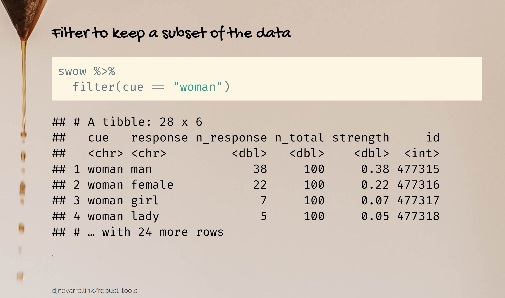
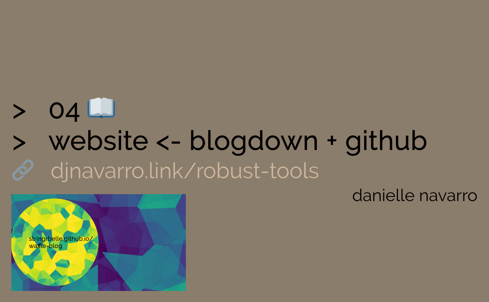
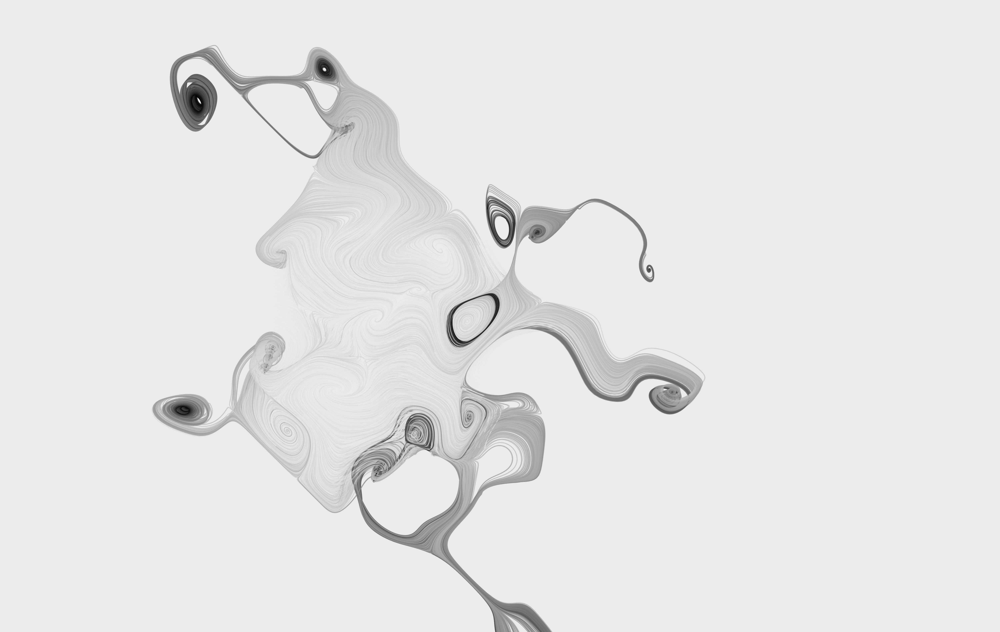
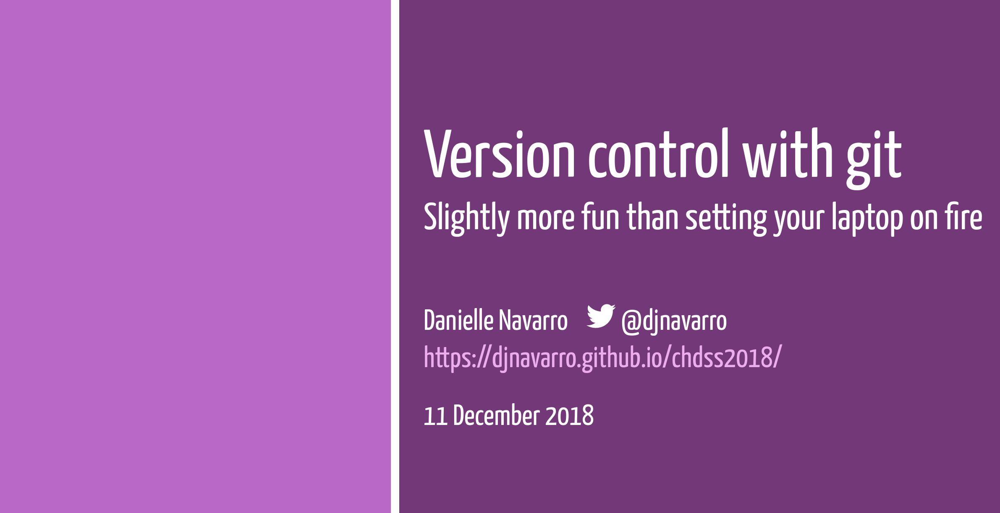

```{r meta, include=FALSE}
# don't run this, the output is included manually in meta.html
library(metathis)
meta() %>%
  meta_general(
    description = "Data science with R: A robust toolkit for psychological research",
  ) %>% 
  meta_name("github-repo" = "djnavarro/robust-tools") %>% 
  meta_social(
    title = "Robust Tools",
    url = "https://djnavarro.github.io/robust-tools/",
    image = "http://djnavarro.github.io/robust-tools/robust.jpg",
    image_alt = "The magrittr pipe in R",
    og_type = "website",
    og_author = "Danielle Navarro",
    twitter_card_type = "summary_large_image",
    twitter_creator = "@djnavarro"
  )
```


The research toolkit in psychological science has changed a lot in the last decade. Across many areas there is a heightened emphasis on transparency, open access, and a preference for the use of freely available tools. These skills are rarely taught during undergraduate psychology classes, and because research methods classes tend to be statistics heavy, they’re rarely a part of research methodology classes either. This elective provides a hands on tutorial in how to use these tools: it covers an introduction to R programming, modern data visualisation and data wrangling, how to structure your projects, version control and how to write professional documents in R. The course is designed for novices, and no preexisting familiarity with these tools and no programming background is assumed. 

## Section 00 :: Getting started

The "zeroth" section of the course is brief. It explains the rationale for learning the tools, discusses some reasons why people might feel anxious about the class, and guides the learner through the process of setting up an RStudio Cloud account. For this section -- as well as later ones -- I have made the [slides](welcome) publicly available, and have posted video of me presenting the slides to [youtube](https://youtu.be/t6IIJEoqPyk). 

## Section 01 :: Data visualisation

The first "real" section of the class provides an introduction to data visualisation in R using ggplot2. It is also assumed to be the *first* contact a student has with R, so it covers a lot of the introductory topics like "what is an R commmand?", "how do I write a script?" and so on. It is intended to be hands-on, alternating between instructor-led content and student exercises. When teaching in-person, I have found this section takes about four hours to complete. As with other sections, it is designed so that you can do it without me: open up the slides and the RStudio Cloud project (both linked below) and then watch the YouTube videos; these will direct you to various hands on exercises you can do within the RStudio Cloud project.

<div class="container">
<div class="box-left">
#### Resources:
- ["Data visualisation" slides](visualisation)
- [RStudio cloud project 901338](https://rstudio.cloud/project/901338)
- [YouTube playlist](https://www.youtube.com/watch?v=6vdHGnD51F8&list=PLRPB0ZzEYegPa4uvvAVJnr6loSKbN4wLb&index=2)
</div>
<div class="box-right">[](visualisation)</div>
</div>

## Section 02 :: Say hello to your data

The second module to the class is a "bridging" section. It introduces a data set (the reasoning data) that I'll use later in the class, discusses reading data from and writing data to a CSV file, and introduces the pipe. Much of this section is devoted to a discussion of calculating "grouped summaries". In the classroom I've found this takes about two hours to cover including all the practice exercises.

<div class="container">
<div class="box-left">
#### Resources:
- ["Hello data" slides](hello)
- [RStudio cloud project 978818](https://rstudio.cloud/project/978818)
- [YouTube playlist](https://www.youtube.com/watch?v=lpbqlu_Sk3M&list=PLRPB0ZzEYegPYKRLwJRh4AbWWSiIlzmC7)
- [The reasoning study](reasoning)
</div>
<div class="box-right">[](hello)</div>
</div>

## Section 03 :: A dplyr dance with data

The third section in the class provides an introduction to data wrangling in R, mostly focusing on dplyr. Topics covered include: extracting a subset of the data, rearranging the data, computing new variables in a data set, merging multiple data sets, and pivoting data between "long" and "wide" forms. Including time to complete the in-class exercises, it usually takes about 4 hours.  

<div class="container">
<div class="box-left">
#### Resources:
- [Data wrangling slides](dancing)
- [RStudio cloud project 1006868](https://rstudio.cloud/project/1006868)
- [YouTube playlist](https://www.youtube.com/watch?v=_LiB4nUKi3o&list=PLRPB0ZzEYegNFsivhQWTFvKvpEc504EPH)
</div>
<div class="box-right">[](dancing)</div>
</div>


## Section 04 :: Literate programming

The fourth section in the class provides an introduction to several topics. The main goal is to teach R markdown, but it does so within a concrete task: creating a website using blogdown and github. It is not assumed that the learner has any familiarity with these topics, so each one is introduced as it becomes relevant. The aim is to teach the core concept (R markdown) while providing initial exposure to other topics (especially git) that will become useful later.
 
<div class="container">
<div class="box-left">
#### Resources:
- [R markdown slides](website)
- [The newblog repository](https://github.com/djnavarro/newblog)
- [The waffle-blog repository](https://github.com/stringrbelle/waffle-blog)
- [The waffle-blog](https://stringrbelle.github.io/waffle-blog)
- [YouTube playlist](https://www.youtube.com/playlist?list=PLRPB0ZzEYegNW7FlGgtAOeZyvkCuiq2BT)
</div>
<div class="box-right">[](website)</div>
</div>


## Section 05 :: Programming Generative Art


The fifth section in the course is an art class, of sorts. Notionally the goal is to build a new generative art system (because everyone loves pretty pictures), but it also serves as a mechanism to introduce key programming concepts: vectors, lists, coercion, logical operations, loops and conditionals are all introduced in this section. 

<div class="container">
<div class="box-left">
#### Resources:
- [R markdown slides](artistry)
- [YouTube playlist](https://www.youtube.com/watch?v=ZUyahWLWVzY&list=PLRPB0ZzEYegNYW3ksiK3dvd6S4HMfKj1n)
- [RStudio cloud project 1112041](https://rstudio.cloud/project/1112041)
</div>
<div class="box-right">[](artistry)</div>
</div>


## Section ?? :: Version control with git

This is a work in progress! The linked slides are from a tutorial I gave in late 2018, and I no longer think this is the best way to teach the material. However, I had to teach this at short notice so for the moment I've left this up in the "old" format...

<div class="container">
<div class="box-left">
- [Slides](https://djnavarro.github.io/chdss2018/day2/git-slides.html)
- [Tutorial](https://djnavarro.github.io/chdss2018/day2/git.html)
</div>
<div class="box-right">[](https://djnavarro.github.io/chdss2018/day2/git-slides.html)</div>
</div>


## Topics to be added... soon

- Writing your own experiments in R
- Structuring your project
- Programming in R
- Archiving with OSF 
- Version control with git
- Documenting with R markdown


<br><br>

<a rel="license" href="http://creativecommons.org/licenses/by-sa/4.0/"></a><br />This work is licensed under a <a rel="license" href="http://creativecommons.org/licenses/by-sa/4.0/">Creative Commons Attribution-ShareAlike 4.0 International License</a>.

