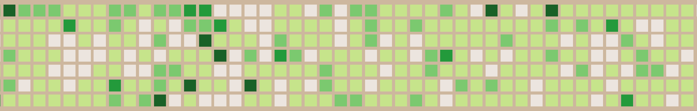
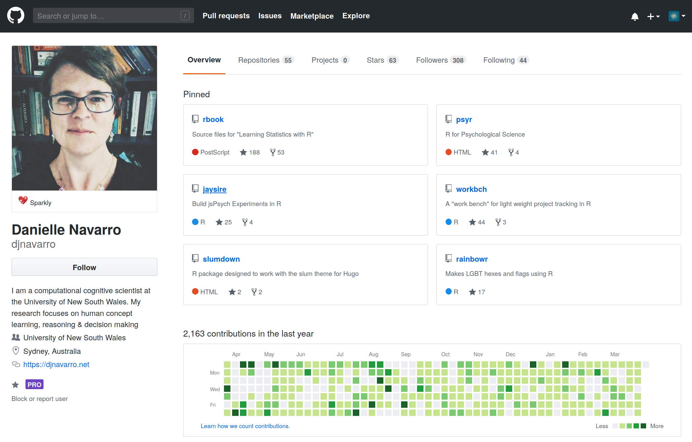
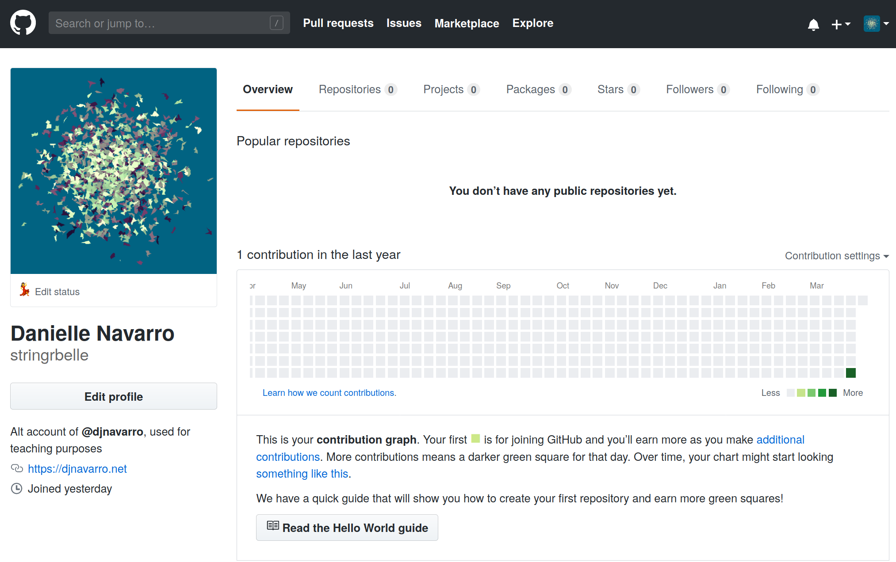

```{r child = "../style/setup.Rmd"}
```

```{r load-packages, message=FALSE, echo=FALSE}
library(countdown)
library(tidyverse)
```


```{r meta, echo=FALSE}
library(metathis)
meta() %>%
  meta_general(
    description = "An introduction to data wrangling in R using tidyverse tools, featuring data from the 'Small World of Words' study",
  ) %>% 
  meta_name("github-repo" = "djnavarro/robust-tools") %>% 
  meta_social(
    title = "A dance with data using dplyr",
    url = "https://djnavarro.github.io/robust-tools/dancing/",
    image = "https://djnavarro.github.io/robust-tools/dancing/img/filter_slide.png",
    image_alt = "Illustration of how the filter() function in the R package dplyr works, showing how to extract a small subset of the so-called 'Small World of Words' data set. The background image is tan, and on the left hand side shows filter coffee dripping downwards.",
    og_type = "website",
    og_author = "Danielle Navarro",
    twitter_card_type = "summary_large_image",
    twitter_creator = "@djnavarro"
  )
```


```{r include=FALSE}
hook_source <- knitr::knit_hooks$get('source')
knitr::knit_hooks$set(source = function(x, options) {
  x <- stringr::str_replace(x, "^[[:blank:]]?([^*].+?)[[:blank:]]*#<<[[:blank:]]*$", "*\\1")
  hook_source(x, options)
})

num_fmt <- scales::number_format(big.mark = ",")
```


class: middle, inverse

background-image: url("img/swow_concreteness_fade.jpg")
background-size: cover

.pull-left-narrow[
  .huge-bisque-number[1]
]
.pull-right-wide[
<br><br><br>
.larger[.embolden[GitHub]]
```{r, echo=FALSE}

```
]

---

class: middle

## https://github.com

- **git**:  software to help you organise your code (more later!)
- **GitHub**: a website for sharing and collaborating code (using git)


---

class: middle

## Me... https://github.com/djnavarro

.pull-left[
```{r, echo=FALSE}

```
]


---

class: middle

## Also me... https://github.com/stringrbelle

.pull-left[
```{r, echo=FALSE}

```
]


---

class: middle, inverse

```{r, echo=FALSE}
knitr::include_graphics("img/stringrbelle_avi.png", dpi = 800)
```
oh hey you have a code repository I would like to use!

```{r, echo=FALSE}
knitr::include_graphics("img/djnavarro_avi.jpeg", dpi = 800)
```
really, which one?

```{r, echo=FALSE}
knitr::include_graphics("img/stringrbelle_avi.png", dpi = 800)
```
this one! https://github.com/djnavarro/newblog

```{r, echo=FALSE}
knitr::include_graphics("img/djnavarro_avi.jpeg", dpi = 800)
```
oh cool. well, you're always welcome to create your own **fork** of the repo. or you can use this one as a **template** for your own if you like!

```{r, echo=FALSE}
knitr::include_graphics("img/stringrbelle_avi.png", dpi = 800)
```
awesome! now, how do i do this??


---

class: middle, inverse

.hand[Create your own!]

- https://github.com/djnavarro/newblog
- create your repository using "djnavarro/newblog" as a template 
- use your respository to create a new RStudio cloud project


---

## 1. go to the "newblog" repository<br>https://github.com/djnavarro/newblog

```{r, echo=FALSE}
knitr::include_graphics("img/github_template2.png", dpi = 120)
```

---


## 2. create "waffle-blog" from the template

```{r, echo=FALSE}
knitr::include_graphics("img/github_template3.png", dpi = 200)
```

---


## 3. copy link to the "waffle-blog" repo

```{r, echo=FALSE}
knitr::include_graphics("img/github_template4.png", dpi = 200)
```


---


## 4. go to https://rstudio.cloud<br>then click the arrow next to "new project"<br><br>

```{r, echo=FALSE}
knitr::include_graphics("img/rstudiocloud_template.png", dpi = 200)
```

---

## 5. create new project from your repo<br><br>

```{r, echo=FALSE}
knitr::include_graphics("img/rstudiocloud_template2.png", dpi = 200)
```


---

## 6. celebrate with cake `r emo::ji("cake")` `r emo::ji("tada")`

```{r, echo=FALSE}
knitr::include_graphics("img/rstudiocloud_template3.png", dpi = 200)
```


