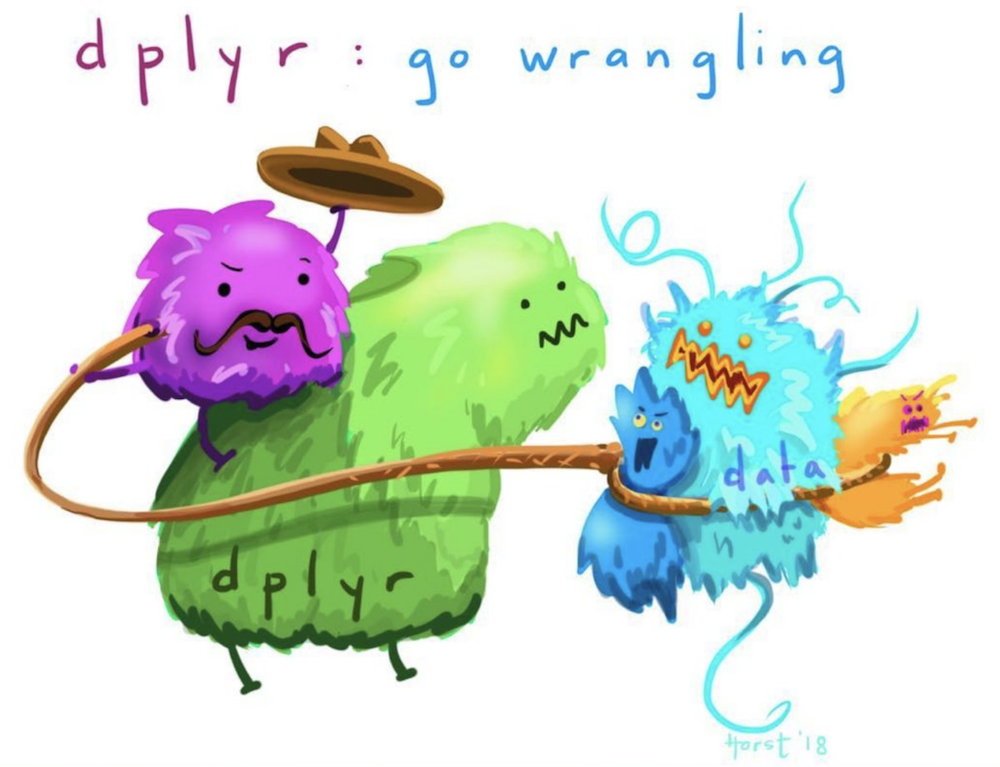

```{r child = "../style/setup.Rmd"}
```

```{r load-packages, message=FALSE, echo=FALSE}
library(countdown)
library(tidyverse)
```

```{r include=FALSE}
hook_source <- knitr::knit_hooks$get('source')
knitr::knit_hooks$set(source = function(x, options) {
  x <- stringr::str_replace(x, "^[[:blank:]]?([^*].+?)[[:blank:]]*#<<[[:blank:]]*$", "*\\1")
  hook_source(x, options)
})
```


class: middle, inverse

background-image: url("img/purple_heart2.png")
background-size: cover
background-color: #0F4C81

.pull-left-narrow[
  .larger[.embolden[.pink[
    class
    starts
    in...
  ]]]
]
```{r echo=FALSE}
countdown(minutes = 1, color_background = "white")
```

---

class: middle inverse

.pull-left[

.hand[Data wrangling]

- **What?** Manipulate data
- **Why?** Data are messy
- **How?** With tidyverse!

```{r, echo=FALSE}

```

]

---

class: middle, inverse

.pull-left-narrow[
  .huge-blue-number[4]
]
.pull-right-wide[
  .larger[
  Organising data
  ]
]

---

class: inverse
.hand[Import data]

```{r read-data, warning=FALSE, message=FALSE, results='hide'}
library(tidyverse)
frames <- read_csv(file = "data_reasoning.csv")
```
--
```{r read-data2, echo=FALSE, warning=FALSE}
print(frames, n = 6, width = 59)
```


---


class: inverse


```{r average-response, results='hide'}
mean_resp <- frames %>%
  group_by(test_item, sample_size, n_obs, condition) %>%
  summarise(response = mean(response)) %>%
  ungroup()

mean_resp %>% #<<
  filter(sample_size == "small") #<<
```

--

- First section creates the summary tibble
- Second section applies a filter...
- ... only retains cases where sample_size = "small"


---
class: inverse
.hand[filter()]

```{r, results='hide', highlight.output = c(4,5)}
mean_resp 
```

--

```{r average-response2c, echo=FALSE, highlight.output = c(8,9)}
mean_resp %>% 
  print(n=6)
```


---
class: inverse
.hand[filter()]

```{r average-response2, results='hide', highlight.output = c(4,5)}
mean_resp %>% 
  filter(sample_size == "small")
```

--

```{r average-response2b, echo=FALSE, highlight.output = c(4,5)}
mean_resp %>% 
  filter(sample_size == "small") %>%
  print(n=6)
```


---
class: inverse
.hand[.]

```{r, results='hide'}
mean_resp %>%
  filter(sample_size == "small")
```
```{r, echo=FALSE, highlight.output = c(4,6)}
mean_resp %>%
  filter(sample_size == "small") %>%
  print(n=6)
```


---
class: inverse
.hand[arrange()]

```{r, results='hide'}
mean_resp %>%
  filter(sample_size == "small") %>%
  arrange(condition) #<<
```
```{r, echo=FALSE, highlight.output = 4:5}
mean_resp %>%
  filter(sample_size == "small") %>%
  arrange(condition) %>%
  print(n=5)
```

---
class: inverse
.hand[select()]

```{r, results='hide'}
mean_resp %>%
  filter(sample_size == "small") %>%
  arrange(condition) %>%
  select(test_item, condition, response) #<<
```
--
```{r, echo=FALSE}
mean_resp %>%
  filter(sample_size == "small") %>%
  arrange(condition) %>%
  select(test_item, condition, response) %>%
  print(n=4)
```


---
class: inverse
.hand[store output as a variable]

```{r, eval=TRUE}
mean_resp_small <- mean_resp %>% #<<
  filter(sample_size == "small") %>%
  arrange(condition) %>%
  select(test_item, condition, response)
```

---
class: inverse
.hand[print output from a variable]

```{r, eval=TRUE}
mean_resp_small <- mean_resp %>%
  filter(sample_size == "small") %>%
  arrange(condition) %>%
  select(test_item, condition, response)

print(mean_resp_small, n = 2) #<<
```


---
class: inverse
.hand[mutate()]

```{r, eval=TRUE}
mean_resp_small %>%
  mutate(generalisation = response/9) %>% #<<
  print(n = 5)
```

---
class: inverse
.hand[mutate() and select()]

```{r, eval=TRUE}
mean_resp_small %>%
  mutate(generalisation = response/9) %>% #<<
  select(-response) %>% #<<
  print(n = 4)
```


---

class: middle
.hand[Wrangling Exercises #5 and #6]

---

class: middle, inverse

.pull-left-narrow[
  .huge-blue-number[5]
]
.pull-right-wide[
  .larger[
  Pivot
  ]
]


---
class: inverse
```{r setup_reshape, results='hide'}
long_data <- mean_resp_small %>%
  mutate(generalisation = response/9) %>% 
  select(-response) %>%
  arrange(test_item) %>%
  print(n = 4)
```
--
```{r ref.label="setup_reshape", echo=FALSE, highlight.output = c(1,4,5)}
```


---
class: inverse
```{r, results='hide'}
wide_data <- long_data %>%
  pivot_wider(
    names_from = condition, #<< 
    values_from = generalisation #<<
  ) 
```


---
class: inverse
```{r, eval=TRUE, highlight.output = c(1,4)}
wide_data <- long_data %>%
  pivot_wider(
    names_from = condition, 
    values_from = generalisation 
  ) %>% 
  print(n = 4)
```


---
class: inverse
```{r, results='hide'}
wide_data %>% 
  pivot_longer(
    cols = c(category, property), #<<
    names_to = "condition", #<<
    values_to = "generalisation" #<<
  )
```


---
class: inverse
```{r, eval=TRUE}
wide_data %>% 
  pivot_longer(
    cols = c(category, property), 
    names_to = "condition", 
    values_to = "generalisation"
  ) %>%
  print(n = 4)
```

---

class: middle
.hand[Wrangling Exercise #6]


---

class: middle, inverse

.pull-left-narrow[
  .huge-blue-number[6]
]
.pull-right-wide[
  .larger[
  Combining datasets
  ]
]


---
class: inverse
.hand[sometimes data come in separate files]
```{r, message=FALSE}
# sometimes from two different surveys...
demographics <- read_csv("data_demographics.csv")
experience <- read_csv("data_experience.csv")

# sometimes from two different participants...
results10 <- read_csv("data_results10.csv")
results20 <- read_csv("data_results20.csv")
```


---
class: inverse
.hand[we want to "stack" these vertically...]
```{r, eval=FALSE}
results10
```
```{r, echo=FALSE}
print(results10, n = 6)
```


---
class: inverse
.hand[we want to "stack" these vertically...]
```{r, eval=FALSE}
results20
```
```{r, echo=FALSE, highlight.output=1}
print(results20, n = 6)
```


---
class: inverse
.hand[we want to "stack" these vertically... with **bind_rows()**]
```{r, eval=FALSE}
bind_rows(results10, results20)
```
```{r, echo=FALSE, highlight.output=1}
print(bind_rows(results10, results20), n = 6)
```

---
class: inverse
.hand[we want to "stack" these vertically... with **bind_rows()**]
```{r, eval=FALSE}
bind_rows(results10, results20) %>% arrange(feature)
```
```{r, echo=FALSE, highlight.output=4:5}
print(bind_rows(results10, results20) %>% arrange(feature), n = 6)
```


---

class: middle
.hand[Wrangling Exercise #7]


---
class: inverse
.hand[we can stack horizontally with **bind_cols()**]
```{r, message=FALSE}
demographics
```

---
class: inverse
.hand[we can stack horizontally with **bind_cols()**]
```{r, eval=FALSE}
experience
```
```{r, echo=FALSE}
print(experience, width=58)
```

---
class: inverse
.hand[we can stack horizontally with **bind_cols()**, though...]
```{r, eval=FALSE}
bind_cols(demographics, experience)
```
```{r, echo=FALSE}
survey <- bind_cols(demographics, experience)
print(survey, width=58)
```


---
class: inverse
.hand[... we may prefer to "merge" using **full_join()**]
```{r, eval=FALSE}
full_join(demographics, experience)
```
```{r, echo=FALSE}
survey <- full_join(demographics, experience)
print(survey, width=58)
```


---
class: inverse
.hand[discussion... what will this do?]
```{r, results='hide', message = FALSE}
surveys <- full_join(demographics, experience)
results <- full_join(results10, results20)
```


---
class: inverse
.hand[discussion... what will this do?]
```{r}
surveys %>% print(width = 58)
```


---
class: inverse
.hand[discussion... what will this do?]
```{r}
results %>% arrange(feature) %>% print(n = 6)
```


---
class: inverse
.hand[discussion... what will this do?]
```{r, eval=FALSE}
full_join(surveys, results)
```


---
class: inverse
.hand[discussion... what will this do?]
```{r}
full_join(surveys, results) %>% print(n = 4, width = 58)
```


---

class: middle
.hand[Wrangling Exercise #8]


