```{r child = "../style/setup.Rmd"}
```

```{r meta, echo=FALSE}
library(metathis)
meta() %>%
  meta_general(
    description = "An introduction to data visualisation in R for new users",
  ) %>% 
  meta_name("github-repo" = "djnavarro/robust-tools") %>% 
  meta_social(
    title = "Data Visualisation",
    url = "https://robust-tools.djnavarro.net/visualisation/",
    image = "https://robust-tools.djnavarro.net/visualisation/img/forensic.png",
    image_alt = "Boxplots summarising the distributions of estimated frequency of handwriting features, as judged by experts and novices, broken down as a function of the true frequency of the feature (split into five bins). Both groups show some skill at the task, but experts appear to be somewhat better.",
    og_type = "website",
    og_author = "Danielle Navarro",
    twitter_card_type = "summary_large_image",
    twitter_creator = "@djnavarro"
  )
```

```{r load-packages, message=FALSE, echo=FALSE}
library(countdown)
```

```{r include=FALSE}
hook_source <- knitr::knit_hooks$get('source')
knitr::knit_hooks$set(source = function(x, options) {
  x <- stringr::str_replace(x, "^[[:blank:]]?([^*].+?)[[:blank:]]*#<<[[:blank:]]*$", "*\\1")
  hook_source(x, options)
})
```

class: middle, inverse

## https://rstudio.cloud/project/901338

???

demo sequence:
- explain RStudio layout
- explain boring R text
- ctrl-L to clear boring text (verbalise shortcut)
- `library(tidyverse)`, explain messages
- `mpg`, explain data
- `?mpg`, explain "help" docs
- clear screen again
- `ggplot(data = mpg)`, explain each component while typing (use the word "function" early!)
- discuss output (note the popups and explain them)
- up arrow to recall last command (verbalise it)
- `+ geom_point(mapping = aes(x = displ, y = hwy))`
- talk them through this bit by bit, but "defer" explanation of `aes()` for now


---

class: middle, inverse

background-image: url("img/code.jpg")
background-size: cover


---

class: middle, inverse

background-image: url("img/code.jpg")
background-size: cover

```{r, echo=FALSE, fig.align='center', out.height=500, out.width=500}
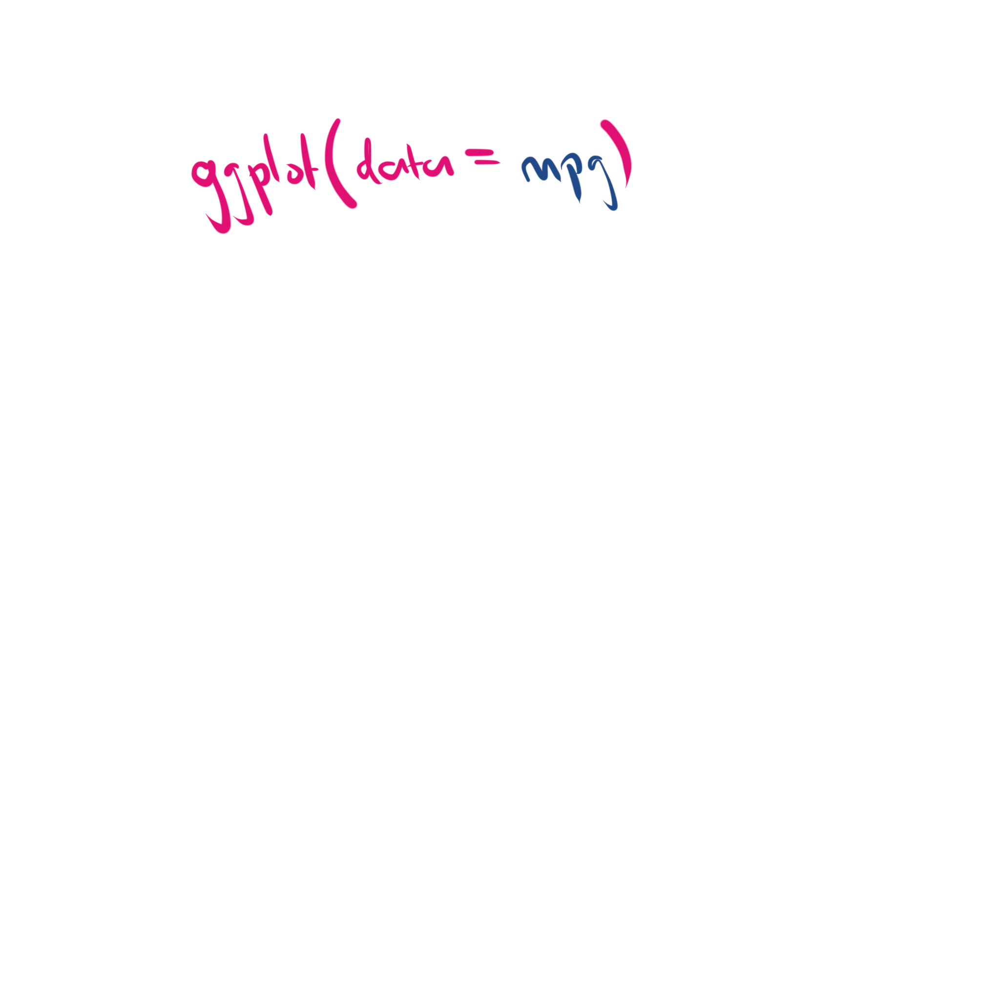
```

???

- this is recap to solidify learning
- `ggplot()` creates the (still blank) plot using `data = mpg`

---

class: middle, inverse

background-image: url("img/code.jpg")
background-size: cover

```{r, echo=FALSE, fig.align='center', out.height=500, out.width=500}
knitr::include_graphics("img/My_First_Plot2.png")
```

---

class: middle, inverse

background-image: url("img/code.jpg")
background-size: cover

```{r, echo=FALSE, fig.align='center', out.height=500, out.width=500}
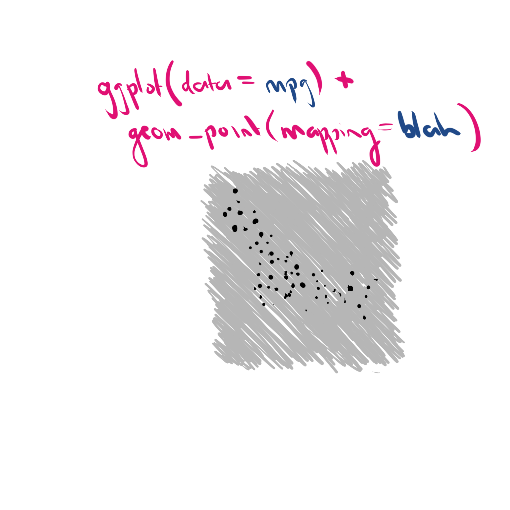
```

???

- then `geom_point()` adds the dots
- ... using the `mapping` (currently referred to as "blah")

---

class: middle, inverse

background-image: url("img/code.jpg")
background-size: cover

```{r, echo=FALSE, fig.align='center', out.height=500, out.width=500}
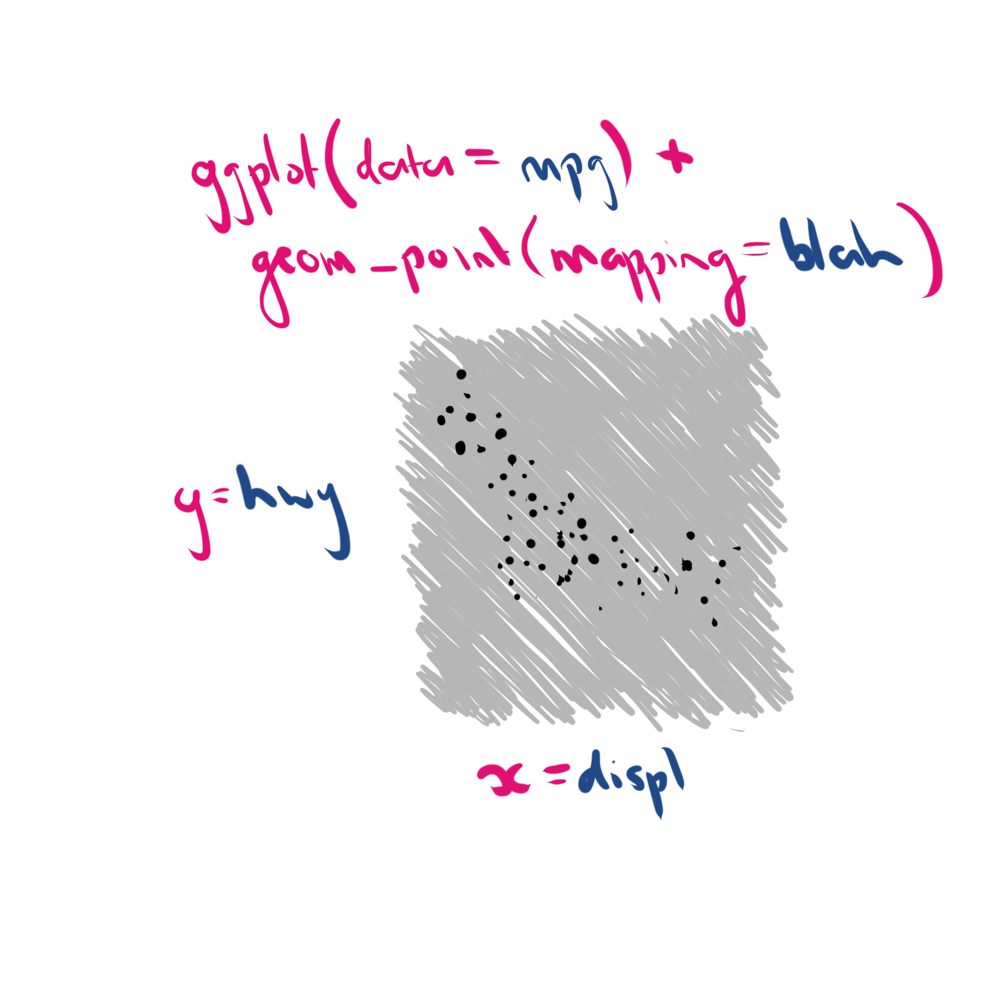
```

???

- the `mapping` tells R *how* to connect the plot to the data
- in this case we map `x` onto the `displ` variable
- and we map `y` onto the `hwy` variable

---

class: middle, inverse

background-image: url("img/code.jpg")
background-size: cover

```{r, echo=FALSE, fig.align='center', out.height=500, out.width=500}
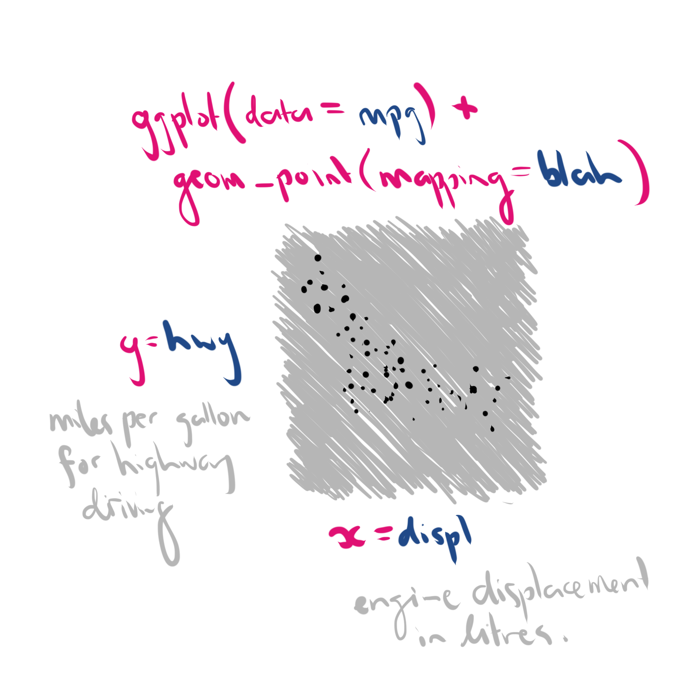
```

???

- `displ` is essentially a measure of engine size
- `hwy` is fuel efficiency for highway driving


---

class: inverse

.pull-left[
.hand[the real code `r emo::ji('heart')`]
```{r hello-r-code, eval=FALSE}
library(tidyverse)
ggplot(data = mpg) +
geom_point(
  mapping = aes(
    x = displ,
    y = hwy
  )
) 
```
]

--

.pull-right[
.hand[... and the real output!]

```{r hello-r-output, echo=FALSE, warning=FALSE, message=FALSE, fig.height=3.75}
library(tidyverse)
ggplot(
  data = mpg,
  mapping = aes(
    x = displ,
    y = hwy
  )
) + 
  geom_point()
```
]

---

class: middle

## .hand[exercise 1...`r emo::ji("women_with_bunny_ears")`]


- how to show the city mileage `cty` as the y-value?
- how to show the manufacture `year` as the x-value?  
- how to show the number of cylinders `cyl` as the colour?
- (bonus): how to include a regression line instead of dot points?

```{r echo=FALSE}
countdown(minutes = 2)
```

???

- they're not expected to know all the answers!
- questions 1-3 promote intuitive grasp of mappings
- question 4 is there to foreshadow geoms

---

class: middle, inverse

.hand[i am very good at art]
```{r, echo=FALSE, fig.align='center', out.height=500, out.width=500}
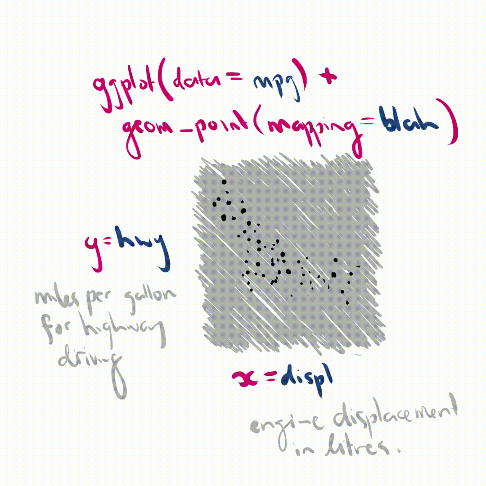
```


---

class: middle

background-image: url("img/maps_light.jpg")
background-size: cover

.pull-left-narrow[
  .huge-blue-number[2]
]
.pull-right-wide[
  .larger[
  &nbsp; aesthetic<br>
  &nbsp; mappings<br>
  &nbsp; `r emo::ji("art")` `r emo::ji("world_map")`
  ]
]


---

class: middle, inverse

background-image: url("img/maps.jpg")
background-size: cover

---

class: middle, inverse

background-image: url("img/maps.jpg")
background-size: cover


```{r, echo=FALSE, fig.align='center', out.height=500, out.width=500}
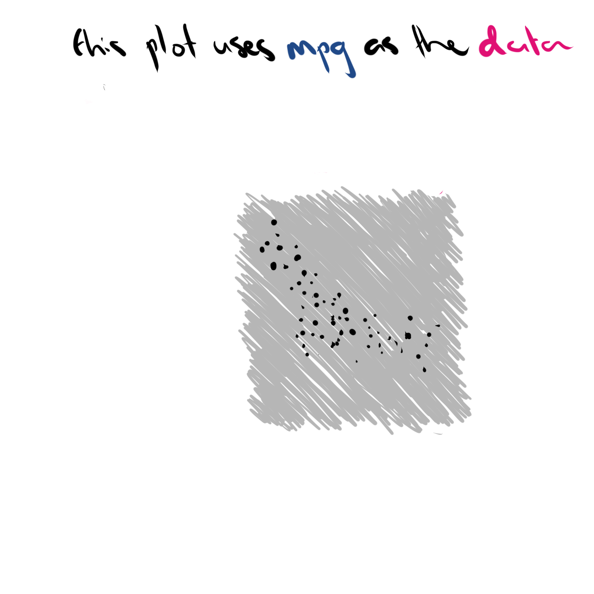
```

???

- let's unpack the contents of that "blah", shall we?
- the `ggplot(data = mpg)` part tells us the `mpg` data go with our plot


---

class: middle, inverse

background-image: url("img/maps.jpg")
background-size: cover

```{r, echo=FALSE, fig.align='center', out.height=500, out.width=500}
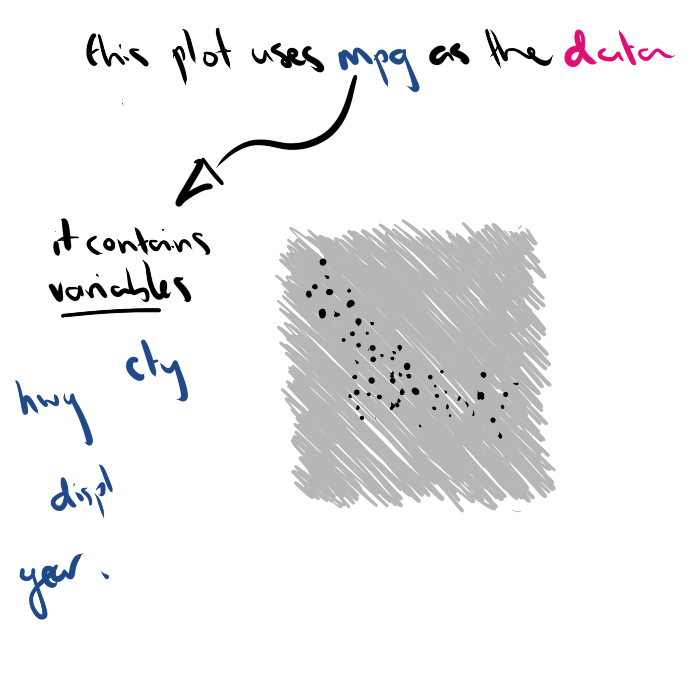
```

???

- the `mpg` data contains "variables"
- here are some of those variables in the data...
- but how do they "map" to the plot???


---

class: middle, inverse

background-image: url("img/maps.jpg")
background-size: cover

```{r, echo=FALSE, fig.align='center', out.height=500, out.width=500}
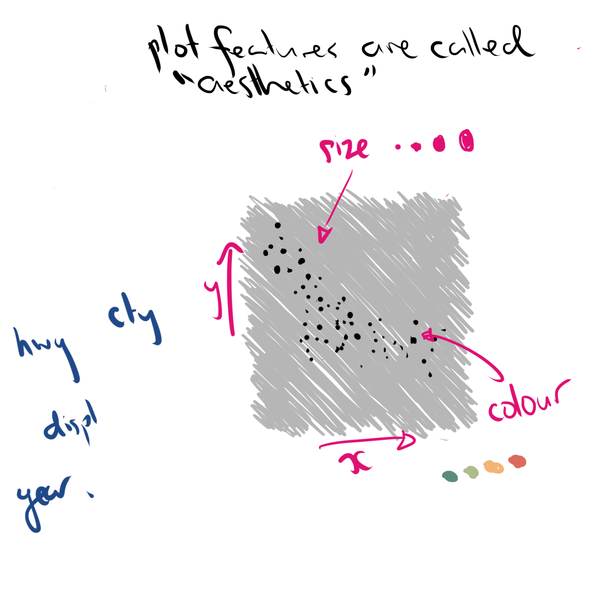
```

???

- the visual content/features of a plot are "aesthetics" 
- `x` coordinates and `y` coordinates are aesthetics
- can include things like `size` and `colour` also
- (mention US/UK spelling)


---

class: middle, inverse

background-image: url("img/maps.jpg")
background-size: cover

```{r, echo=FALSE, fig.align='center', out.height=500, out.width=500}
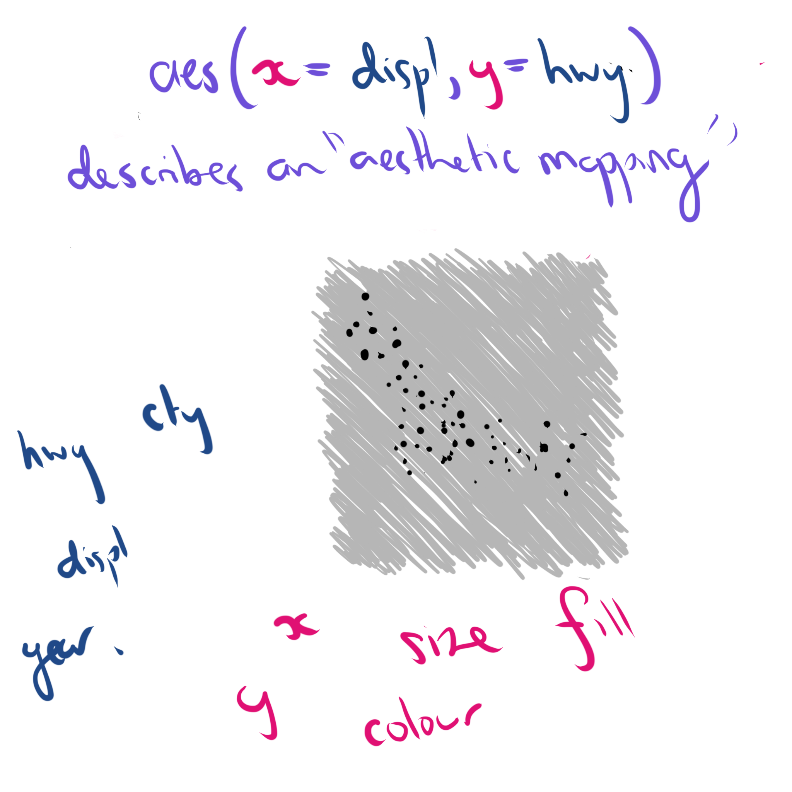
```

???

- that "blah" was an **aesthetic mapping**
- it tells R which plot aesthetics are mapped onto which variables in the data


---

class: middle, inverse

background-image: url("img/maps.jpg")
background-size: cover

```{r, echo=FALSE, fig.align='center', out.height=500, out.width=500}
knitr::include_graphics("img/Mapping5.png")
```


---

class: middle, inverse

background-image: url("img/maps.jpg")
background-size: cover

```{r, echo=FALSE, fig.align='center', out.height=500, out.width=500}
knitr::include_graphics("img/Mapping6.png")
```


---

class: inverse

.pull-left[
.hand[using real code this time...]
```{r hello-r-code-3, eval=FALSE}
ggplot(data = mpg) +
geom_point(
  mapping = aes( #<<
    x = displ, #<<
    y = hwy #<<
  ) #<<
) 
```
]


---

class: inverse

.pull-left[
.hand[using real code this time...]
```{r hello-r-code-4, results='hide'}
aes(
  x = displ,
  y = hwy 
) 
```
]
--
.pull-right[
.hand[.]
```{r ref.label = "hello-r-code-4", echo=FALSE}
```
]


---

class: inverse

.pull-left[
.hand[can we add colour to this?]
```{r hello-r-code-2, eval=FALSE}
ggplot(data = mpg) +
geom_point(
  mapping = aes(
    x = displ,
    y = hwy
  )
) 
```
]

.pull-right[
.hand[.]

```{r hello-r-output-2, echo=FALSE, warning=FALSE, message=FALSE, fig.height=3.75}
ggplot(
  data = mpg,
  mapping = aes(
    x = displ,
    y = hwy
  )
) + 
  geom_point()
```
]

???

- ask them to set colour to the number of cylinders `cyl`
- (not a class exercise, just to segue...)

---

class: inverse

.pull-left[
.hand[add **colour** to the mapping!]
```{r hello-r-color, fig.show='hide'}
ggplot(data = mpg) +
geom_point(
  mapping = aes(
    x = displ,
    y = hwy,
    color = cyl #<<
  )
) 
```
]

--

.pull-right[
.hand[...the output gets colour]

```{r ref.label="hello-r-color", echo=FALSE, warning=FALSE, message=FALSE, fig.height=3.75}
```
]

???

- prompt: is something wrong here?
- hint: can you have 5.21 cylinders in an engine?
- (don't give them the answer yet...)


---

class: middle

## .hand[exercise 2...`r emo::ji("woman_technologist")`]

code along with me while we...
- look at the `mpg` data
- recreate the last plot
- change the mapped **variables** (type `mpg` to see variables)
- change the mapped **aesthetics** (e.g. `x`, `y`, `color`, `size`, `fill`, `shape`)

???

- do the typing in rstudio cloud and get them to type along 
- get them to suggest possible code edits...
- let them discover the "continuous variable cannot be mapped..." error
- talk them through it and show them `factor()` as the answer

```{r echo=FALSE}
countdown(minutes = 2)
```


---


class: middle

background-image: url("img/layer-cake_light.jpg")
background-size: cover

.pull-left-narrow[
  .huge-blue-number[3]
]
.pull-right-wide[
  .larger[
  &nbsp; layered<br>
  &nbsp; plots<br>
  &nbsp; `r emo::ji("cake")`
  ]
]


---

class: middle, inverse

background-image: url("img/layer-cake.jpg")
background-size: cover


---

class: middle, inverse

background-image: url("img/layer-cake.jpg")
background-size: cover


```{r, echo=FALSE, fig.align='center', out.height=500, out.width=500}
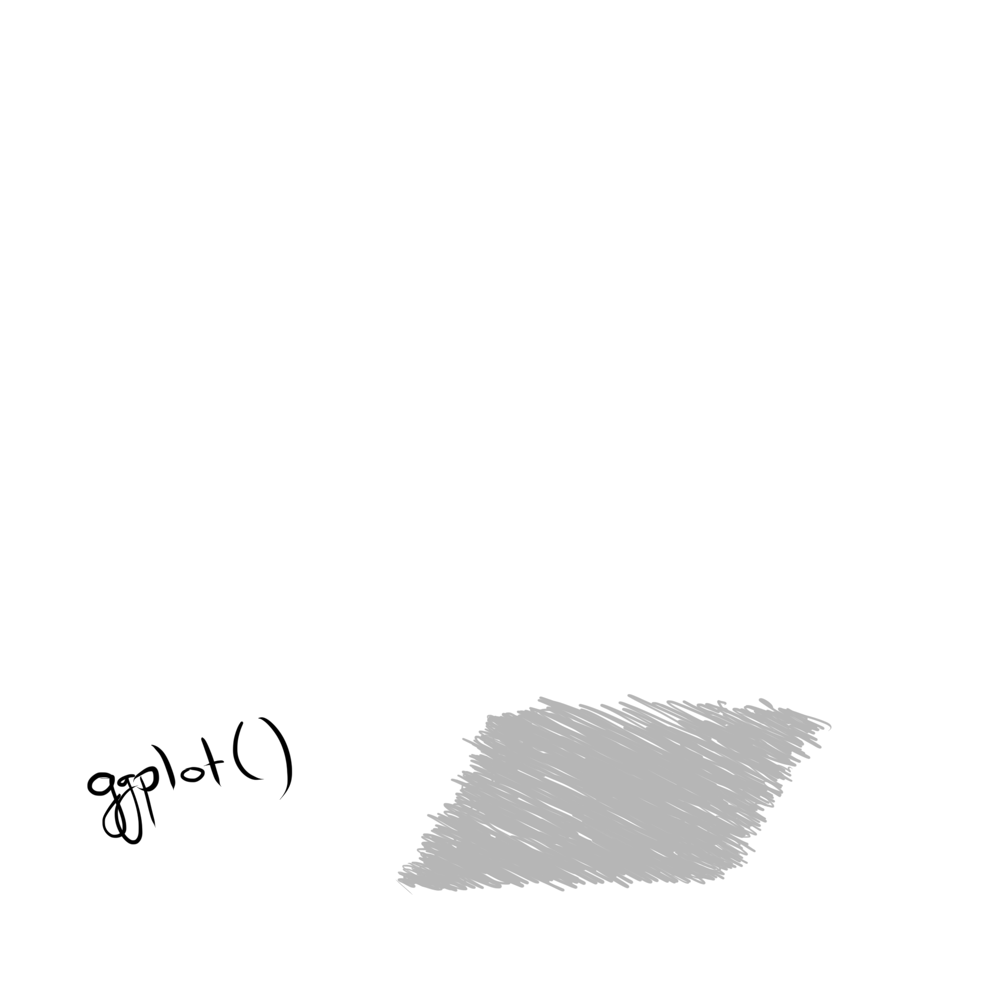
```


---

class: middle, inverse

background-image: url("img/layer-cake.jpg")
background-size: cover


```{r, echo=FALSE, fig.align='center', out.height=500, out.width=500}
knitr::include_graphics("img/Layers2.png")
```

---

class: middle, inverse

background-image: url("img/layer-cake.jpg")
background-size: cover


```{r, echo=FALSE, fig.align='center', out.height=500, out.width=500}
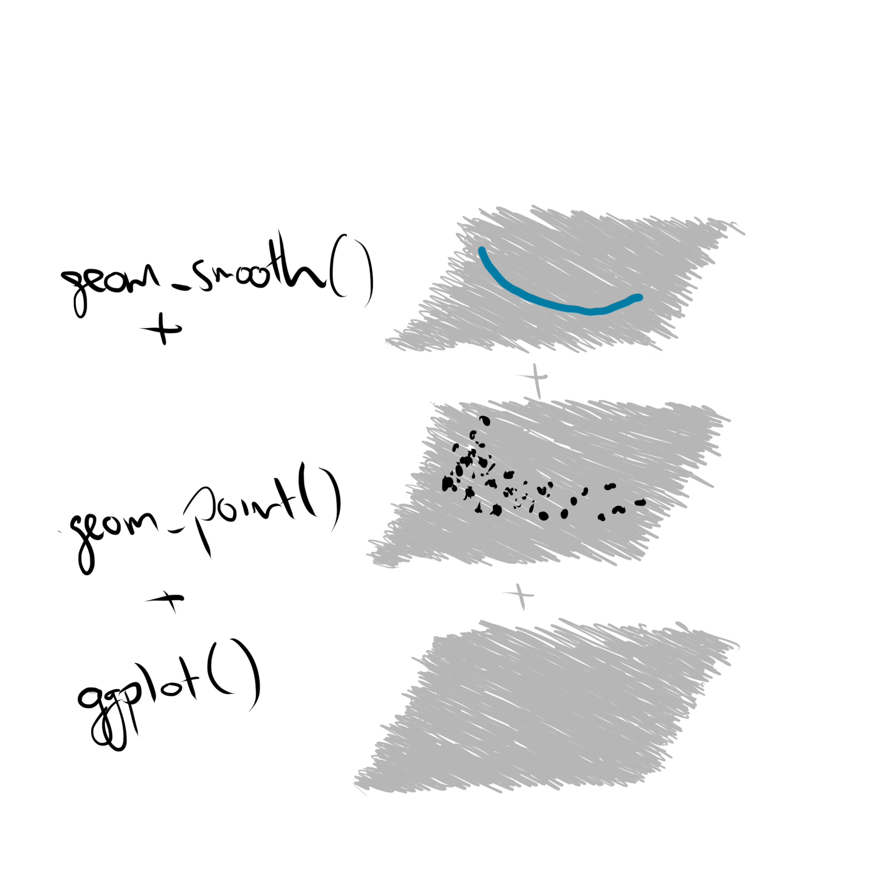
```


---

class: inverse

.pull-left[
.hand[our plot has a "points" layer]
```{r adding-geoms-prelude, fig.show='hide'}
ggplot(data = mpg) +
geom_point( #<<
  mapping = aes(
    x = displ,
    y = hwy,
    color = cyl 
  )
) 
```
]

--

.pull-right[
.hand[.]

```{r ref.label="adding-geoms-prelude", echo=FALSE, warning=FALSE, message=FALSE, fig.height=3.75}
```
]

---

class: inverse

.pull-left[
.hand[adding **geom_smooth()**]
```{r adding-geoms, fig.show='hide'}
ggplot(data = mpg) +
geom_point(
  mapping = aes(
    x = displ,
    y = hwy,
    color = cyl 
  )
) + 
geom_smooth( #<<
  mapping = aes( #<<
    x = displ, #<<
    y = hwy #<<
  ) #<<
) #<<
```
]

.pull-right[
.hand[paints another layer]

```{r ref.label="adding-geoms", echo=FALSE, warning=FALSE, message=FALSE, fig.height=3.75}
```
]


---

class: middle

## .hand[exercise 3...`r emo::ji("woman_technologist")`]

code along with me while we...
- recreate the plot with `geom_point()` only
- add the `geom_smooth()` layer
- add a third layer with `geom_rug()`

```{r echo=FALSE}
countdown(minutes = 2)
```


---


class: middle

background-image: url("img/tidy.jpg")
background-size: cover


.pull-left-narrow[
  .huge-blue-number[4]
]
.pull-right-wide[
  .larger[
  &nbsp;&nbsp;tidy code
  ]
]


---

class: inverse

.pull-left[
.hand[hm... this is annoying]
```{r redundancy, fig.show='hide', warning=FALSE, message=FALSE}
ggplot(data = mpg) +
geom_point(
  mapping = aes( #<<
    x = displ, #<<
    y = hwy, #<<
    color = cyl 
  )
) + 
geom_smooth(
  mapping = aes( #<<
    x = displ, #<<
    y = hwy #<<
  ) 
) 
```
]

--

.pull-right[
.hand[can we eliminate this redundancy?]
- `x` and `y` values are the same
- make them **global** aesthetics
]

---

class: inverse

.pull-left[
.hand[we can just move the code!]
```{r redundancy2, fig.show='hide', warning=FALSE, message=FALSE}
ggplot(data = mpg,
  mapping = aes( #<<
    x = displ, #<<
    y = hwy #<<
  ) #<<
) +
geom_point(
  mapping = aes(
    color = cyl 
  )
) + 
geom_smooth() 
```
]

--

.pull-right[
<br>
- the `mapping` within the `ggplot()` command is "global"
]


---

class: inverse

.pull-left[
.hand[we can just move the code!]
```{r redundancy3, fig.show='hide', warning=FALSE, message=FALSE}
ggplot(data = mpg,
  mapping = aes( 
    x = displ, 
    y = hwy 
  ) 
) +
geom_point( #<<
  mapping = aes(
    color = cyl 
  )
) + 
geom_smooth() #<<
```
]

.pull-right[
<br>
- the `mapping` within the `ggplot()` command is "global"
- both "geoms" will use the `x` and `y` values that they "inherit"
]


---

class: inverse

.pull-left[
.hand[we can just move the code!]
```{r redundancy6, fig.show='hide', warning=FALSE, message=FALSE}
ggplot(data = mpg,
  mapping = aes( 
    x = displ, 
    y = hwy 
  ) 
) +
geom_point(
  mapping = aes( #<<
    color = cyl  #<<
  ) #<<
) + 
geom_smooth()
```
]

.pull-right[
<br>
- the `mapping` within the `ggplot()` command is "global"
- both "geoms" will use the `x` and `y` values that they "inherit"
- the `color` aesthetic remains "local" to `geom_point()`
]


---

class: inverse

.left[
.hand[same code, just neater!]
```{r redundancy4, fig.show='hide', warning=FALSE, message=FALSE}
ggplot(
  data = mpg,
  mapping = aes(x = displ, y = hwy)
) +
geom_point(mapping = aes(color = cyl)) + 
geom_smooth() 
```
]


---

.left[
.hand[exercise 4... paired discussion `r emo::ji("women_with_bunny_ears")`]
```{r redundancy5, fig.show='hide', warning=FALSE, message=FALSE}
ggplot(
  data = mpg,
  mapping = aes(x = displ, y = hwy)
) +
geom_point(mapping = aes(color = cyl)) + 
geom_smooth() 
```
]

.left[
- what are the **variables**?
- what are the **geoms**, and what do they do?
- identify the R **functions** this code uses 
- why did I say this is the "same" code as before?
]


```{r, echo=FALSE}
countdown(minutes = 2)
```
---

class: middle

background-image: url("img/dinosaur.jpg")
background-size: cover

.pull-left-narrow[
  .huge-blue-number[5]
]
.pull-right-wide[
  .larger[
  `r emo::ji("women_with_bunny_ears")`
  ]
]


---


background-image: url("img/dinosaur.jpg")
background-size: cover

.pull-left-wide[
.hand[exercise_ggplot_05.R]
```{r ggplot_exercise_01, fig.show='hide', warning=FALSE, message=FALSE}
library(tidyverse)

dino <- read_csv("data_dino.csv")
picture <- ggplot(data = dino) + 
  geom_point(
    mapping = aes(
      x = horizontal, 
      y = vertical
    )
  )

plot(picture)
```

```{r, echo=FALSE}
countdown(minutes = 2)
```
]

--

.pull-right-narrow[
<br><br>
```{r ref.label="ggplot_exercise_01", echo=FALSE, warning=FALSE, message=FALSE, fig.height=3.75}
```
]


---

class: middle

background-image: url("img/handwriting_light.jpg")
background-size: cover


.pull-left-narrow[
  .huge-blue-number[6]
]
.pull-right-wide[
  .larger[
  &nbsp;naming<br>&nbsp;things<br>
  ]
]


---

class: inverse

.pull-left-wide[
.hand[from the exercise]
```{r ggplot_exercise_01x, fig.show='hide', warning=FALSE, message=FALSE}
dino <- read_csv("data_dino.csv")
picture <- ggplot(data = dino) + #<<
  geom_point(
    mapping = aes(
      x = horizontal, 
      y = vertical
    )
  )
plot(picture)
```
]

.pull-right-narrow[
<br><br>
```{r ref.label="ggplot_exercise_01x", echo=FALSE, warning=FALSE, message=FALSE, fig.height=3.75}
```
]


---

class: inverse

.pull-left-wide[
.hand[this is the same!]
```{r ggplot_exercise_01b, fig.show='hide', warning=FALSE, message=FALSE}
dino <- read_csv("data_dino.csv")
picture <- ggplot(dino) + #<<
  geom_point(
    mapping = aes(
      x = horizontal, 
      y = vertical
    )
  )
plot(picture)
```
]

.pull-right-narrow[
<br><br>
```{r ref.label="ggplot_exercise_01b", echo=FALSE, warning=FALSE, message=FALSE, fig.height=3.75}
```
]

--

.pull-left-wide[
- named argument: `ggplot(data = dino)`
- unnamed argument: `ggplot(dino)`
]


---

class: inverse

.pull-left-wide[
.hand[unnamed arguments]
```{r ggplot_exercise_01d, fig.show='hide', warning=FALSE, message=FALSE}
dino <- read_csv("data_dino.csv") #<<
picture <- ggplot(dino) + #<<
  geom_point(
    mapping = aes(
      x = horizontal, 
      y = vertical
    )
  )
plot(picture) #<<
```
]

.pull-right-narrow[
<br><br>
```{r ref.label="ggplot_exercise_01d", echo=FALSE, warning=FALSE, message=FALSE, fig.height=3.75}
```
]


---

class: inverse

.pull-left-wide[
.hand[named argument]
```{r ggplot_exercise_01f, fig.show='hide', warning=FALSE, message=FALSE}
dino <- read_csv("data_dino.csv") 
picture <- ggplot(dino) + 
  geom_point( 
    mapping = aes( #<<
      x = horizontal,
      y = vertical
    ) 
  ) 
plot(picture) 
```
]

.pull-right-narrow[
<br><br>
```{r ref.label="ggplot_exercise_01f", echo=FALSE, warning=FALSE, message=FALSE, fig.height=3.75}
```
]


---

class: inverse

.pull-left-wide[
.hand[unnamed]
```{r ggplot_exercise_01c, fig.show='hide', warning=FALSE, message=FALSE}
dino <- read_csv("data_dino.csv")
picture <- ggplot(dino) + 
  geom_point(
    aes( #<<
      x = horizontal, 
      y = vertical
    )
  ) 
plot(picture)
```

]

.pull-right-narrow[
<br><br>
```{r ref.label="ggplot_exercise_01c", echo=FALSE, warning=FALSE, message=FALSE, fig.height=3.75}
```
]


---

class: inverse

.pull-left-wide[
.hand[one more time!]
```{r ggplot_exercise_01y, fig.show='hide', warning=FALSE, message=FALSE}
dino <- read_csv("data_dino.csv")
picture <- ggplot(dino) + 
  geom_point(
    aes( 
      x = horizontal, #<<
      y = vertical #<<
    )
  ) 
plot(picture)
```

]

.pull-right-narrow[
<br><br>
```{r ref.label="ggplot_exercise_01y", echo=FALSE, warning=FALSE, message=FALSE, fig.height=3.75}
```
]


---

class: inverse

.pull-left-wide[
.hand[one more time!]
```{r ggplot_exercise_01z, fig.show='hide', warning=FALSE, message=FALSE}
dino <- read_csv("data_dino.csv")
picture <- ggplot(dino) + 
  geom_point(
    aes( 
      horizontal, #<<
      vertical #<<
    )
  ) 
plot(picture)
```

]

.pull-right-narrow[
<br><br>
```{r ref.label="ggplot_exercise_01z", echo=FALSE, warning=FALSE, message=FALSE, fig.height=3.75}
```
]


---

class: inverse

.pull-left-wide[
.hand[one more time!]
```{r ggplot_exercise_01e, fig.show='hide', warning=FALSE, message=FALSE}
dino <- read_csv("data_dino.csv")
picture <- ggplot(dino) + 
  geom_point(aes(horizontal, vertical)) #<<

plot(picture)
```

]


.pull-right-narrow[
<br><br>
```{r ref.label="ggplot_exercise_01e", echo=FALSE, warning=FALSE, message=FALSE, fig.height=3.75}
```
]


---

class: inverse

.pull-left-wide[
.hand[ggplot2 code often looks like this!]
```{r ggplot_exercise_01g, fig.show='hide', warning=FALSE, message=FALSE}
dino <- read_csv("data_dino.csv")
picture <- ggplot(dino) + #<<
  geom_point(aes(horizontal, vertical)) #<<

plot(picture)
```

]


.pull-right-narrow[
<br><br>
```{r ref.label="ggplot_exercise_01g", echo=FALSE, warning=FALSE, message=FALSE, fig.height=3.75}
```
]


---

class: middle

background-image: url("img/exercise.jpg")
background-size: cover


.pull-left-narrow[
  .huge-blue-number[7]
]
.pull-right-wide[
  .larger[
  &nbsp;`r emo::ji("swimming_man")`
  ]
]


---

class: middle

.hand[exercises 6-8... emoji translation!]

```{r, echo=FALSE, out.width=600}
knitr::include_graphics("img/Exercise04.png")
```


---

class: middle

.hand[exercises 9-10... forensic handwriting expertise]

.pull-left[
```{r, echo=FALSE, out.width=600}
knitr::include_graphics("img/handwriting.jpg")
```
]
.pull-right[
- Martire, Growns & Navarro (2018) *What do the experts know? Calibration, precision, and the wisdom of crowds among forensic handwriting experts*
- https://psyarxiv.com/pq7kz
]


```{r, echo=FALSE, message=FALSE}
forensic <- read_csv("data_forensic.csv")
```

---

class: middle

.hand[exercise 9 plot]

```{r exercise9, echo=FALSE, warning=FALSE, message=FALSE, out.height=400, out.width=600}
ggplot(data = forensic) + 
  geom_point(
    mapping = aes(
      x = true, 
      y = est
    )
  )
```


---

.pull-left[
.hand[exercise 10 solution]
```{r exercise10a, eval=FALSE}
ggplot(data = forensic) + 
  geom_boxplot(
    mapping = aes(
      x = band, 
      y = est
    )
  )
```
]
.pull-right[
<br><br>
```{r, ref.label="exercise10a", echo=FALSE, message=FALSE, warning=FALSE}
```
]


---

.pull-left[
.hand[exercise 10 solution]
```{r exercise10b, eval=FALSE}
ggplot(data = forensic) + 
  geom_violin( #<<
    mapping = aes(
      x = band, 
      y = est
    )
  )
```
]
.pull-right[
<br><br>
```{r, ref.label="exercise10b", echo=FALSE, message=FALSE, warning=FALSE}
```
]


---

class: middle

background-image: url("img/facets.jpg")
background-size: cover


.pull-left-narrow[
  .huge-blue-number[8]
]
.pull-right-wide[
  .larger[
  &nbsp; facets <br>
  &nbsp; `r emo::ji("black_square_button")` `r emo::ji("black_square_button")`<br>
  &nbsp; `r emo::ji("black_square_button")` `r emo::ji("black_square_button")`<br>
  ]
]


---

class: inverse

.hand[split experts and novices?]
```{r facet0, message=FALSE, warning=FALSE, out.height=300}
ggplot(forensic) + 
  geom_boxplot(aes(x = band, y = est)) 
```

---

class: inverse

.hand[split experts and novices?]
```{r facet1, message=FALSE, warning=FALSE, out.height=300, out.width=600}
ggplot(forensic) + 
  geom_boxplot(aes(x = band, y = est)) + 
  facet_wrap(vars(handwriting_expert)) #<<
```


---

class: middle

background-image: url("img/one_art_please.png")
background-size: cover

.pull-left-narrow[
  .huge-blue-number[9]
]
.pull-right-wide[
  .larger[
  &nbsp; <span style="color:white;font-weight: bold">glamour</span><br>
  &nbsp; <span style="color:white;font-weight: bold">graphics</span>
  ]
]


---

class: inverse

<blockquote class="twitter-tweet tw-align-center"><p lang="en" dir="ltr">The recording of my <a href="https://twitter.com/hashtag/rstudioconf?src=hash&amp;ref_src=twsrc%5Etfw">#rstudioconf</a> talk, The Glamour of Graphics is up! 💅 Enjoy, and keep in mind these are guidelines, not rules. <a href="https://twitter.com/hashtag/rstats?src=hash&amp;ref_src=twsrc%5Etfw">#rstats</a> <a href="https://t.co/VHz05yAs09">https://t.co/VHz05yAs09</a></p>&mdash; Will Chase (@W_R_Chase) <a href="https://twitter.com/W_R_Chase/status/1228683209422057479?ref_src=twsrc%5Etfw">February 15, 2020</a></blockquote>

.


---

.pull-left[
```{r style0, results="hide", fig.show='hide', message=FALSE, warning=FALSE, out.height=300, out.width=600}
pic <- ggplot(
  data = forensic
) + 
geom_boxplot(
  mapping = aes(
    x = band, 
    y = est, 
    fill = band
  )
) + 
facet_wrap(
  vars(handwriting_expert)
)
plot(pic)
```
]

--

.pull-right[
```{r, ref.label="style0", echo=FALSE, message=FALSE, warning=FALSE, out.height=300, out.width=600}
```
]


---


.pull-left[
```{r style1, results="hide", fig.show='hide', message=FALSE, warning=FALSE, out.height=300, out.width=600}
pic + 
  theme_minimal() 
```
]
.pull-right[
```{r, ref.label="style1", echo=FALSE, message=FALSE, warning=FALSE, out.height=300, out.width=600}
```
]


---


.pull-left[
```{r style2, results="hide", fig.show='hide', message=FALSE, warning=FALSE, out.height=300, out.width=600}
pic + 
  theme_minimal() + 
  scale_x_discrete(
    name = NULL,
    labels = NULL
  )
```
]
.pull-right[
```{r, ref.label="style2", echo=FALSE, message=FALSE, warning=FALSE, out.height=300, out.width=600}
```
]


---


.pull-left[
```{r style3, results="hide", fig.show='hide', message=FALSE, warning=FALSE, out.height=300, out.width=600}
pic <- pic + 
  theme_minimal() + 
  scale_x_discrete(
    name = NULL,
    labels = NULL
  ) + 
  scale_y_continuous(
    name = NULL
  )
pic
```
]

.pull-right[
```{r, ref.label="style3", echo=FALSE, message=FALSE, warning=FALSE, out.height=300, out.width=600}
```
]


---


.pull-left[
```{r style4, results="hide", fig.show='hide', message=FALSE, warning=FALSE, out.height=300, out.width=600}
pic <- pic + ggtitle(
  "Estimated frequency of handwriting features"
)
pic
```
]
.pull-right[
```{r, ref.label="style4", echo=FALSE, message=FALSE, warning=FALSE, out.height=300, out.width=600}
```
]


---


.pull-left[
```{r style5, results="hide", fig.show='hide', message=FALSE, warning=FALSE, out.height=300, out.width=600}
pic + 
  scale_fill_viridis_d()
```
]
.pull-right[
```{r, ref.label="style5", echo=FALSE, message=FALSE, warning=FALSE, out.height=300, out.width=600}
```
]


---


.pull-left[
```{r style6, results="hide", fig.show='hide', message=FALSE, warning=FALSE, out.height=300, out.width=600}
pic + 
  scale_fill_viridis_d(
    alpha = .5
  )
```
]
.pull-right[
```{r, ref.label="style6", echo=FALSE, message=FALSE, warning=FALSE, out.height=300, out.width=600}
```
]


---


.pull-left[
```{r style7, results="hide", fig.show='hide', message=FALSE, warning=FALSE, out.height=300, out.width=600}
pic + 
  scale_fill_viridis_d(
    alpha = .5,
    name = NULL
  )
```
]
.pull-right[
```{r, ref.label="style7", echo=FALSE, message=FALSE, warning=FALSE, out.height=300, out.width=600}
```
]


---


```{r, ref.label="style7", echo=FALSE, message=FALSE, warning=FALSE, fig.height=4, fig.width=8, fig.align="center"}
```


---


```{r style8, echo=FALSE, message=FALSE, warning=FALSE, fig.height=4, fig.width=8, fig.align="center"}
forensic2 <- forensic %>%
  drop_na() %>%
  mutate(handwriting_expert = fct_recode(handwriting_expert,
    "Experts" = "HW Expert", "Novices" = "Novice"
  ))

ggplot(forensic2) + 
  geom_boxplot(aes(x = band, y = est, fill = band)) + 
  facet_wrap(vars(handwriting_expert)) +
  theme_minimal() + 
  scale_x_discrete(name = NULL, labels = NULL) + 
  scale_y_continuous(name = NULL) + 
  scale_fill_viridis_d(alpha = .5, name = NULL) +
  ggtitle("Estimated frequency of handwriting features")
```


---

.hand[So now you know the basics. Where to next?]

*Refresher?* ...try this lovely tutorial! <br>
https://ggplot2tutor.com/beginner_tutorial/beginner_tutorial/

*A classic?* ...look into "R for Data Science" <br>
https://r4ds.had.co.nz/data-visualisation.html

*This but extra?* ...I wrote an advanced workshop<br>
https://djnavarro.github.io/satrdayjoburg/

*A full book?* ...Keiran Healy's book is very good! <br>
https://socviz.co/

