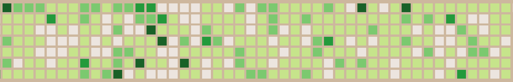
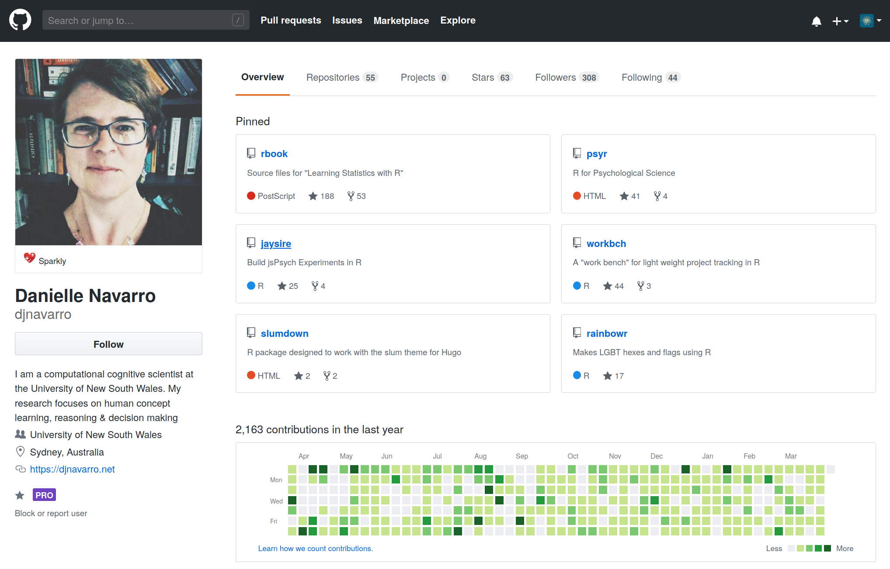

```{r child = "../style/setup.Rmd"}
```

```{r load-packages, message=FALSE, echo=FALSE}
library(countdown)
library(tidyverse)
```


```{r meta, echo=FALSE}
library(metathis)
meta() %>%
  meta_general(
    description = "An introduction to R markdown, blogdown and github",
  ) %>% 
  meta_name("github-repo" = "djnavarro/robust-tools") %>% 
  meta_social(
    title = "Make a website with blogdown and github",
    url = "https://djnavarro.github.io/robust-tools/website/",
    image = "https://djnavarro.github.io/robust-tools/website/img/twitter-card.png",
    image_alt = "",
    og_type = "website",
    og_author = "Danielle Navarro",
    twitter_card_type = "summary_large_image",
    twitter_creator = "@djnavarro"
  )
```


```{r include=FALSE}
hook_source <- knitr::knit_hooks$get('source')
knitr::knit_hooks$set(source = function(x, options) {
  x <- stringr::str_replace(x, "^[[:blank:]]?([^*].+?)[[:blank:]]*#<<[[:blank:]]*$", "*\\1")
  hook_source(x, options)
})

num_fmt <- scales::number_format(big.mark = ",")
```


class: middle, inverse

.pull-left-narrow[
  .huge-bisque-number[1]
]
.pull-right-wide[
<br><br><br>
.larger[.embolden[GitHub]]
```{r, echo=FALSE}

```
]

---

class: middle

## https://github.com

- **git**:  software to help you organise your code (more later!)
- **GitHub**: a website for sharing and collaborating code (using git)


---

class: middle

## Me... https://github.com/djnavarro

.pull-left[
```{r, echo=FALSE}

```
]


---

class: middle

## Also me... https://github.com/stringrbelle

.pull-left[
```{r, echo=FALSE}
knitr::include_graphics("img/stringrbelle_github.png")
```
]


---

class: middle, inverse

```{r, echo=FALSE}
knitr::include_graphics("img/stringrbelle_avi.png", dpi = 800)
```
oh hey you have a code repository I would like to use!

```{r, echo=FALSE}
knitr::include_graphics("img/djnavarro_avi.jpeg", dpi = 800)
```
really, which one?

```{r, echo=FALSE}
knitr::include_graphics("img/stringrbelle_avi.png", dpi = 800)
```
this one! https://github.com/djnavarro/newblog

```{r, echo=FALSE}
knitr::include_graphics("img/djnavarro_avi.jpeg", dpi = 800)
```
oh cool. well, you're always welcome to create your own **fork** of the repo. or you can use this one as a **template** for your own if you like!

```{r, echo=FALSE}
knitr::include_graphics("img/stringrbelle_avi.png", dpi = 800)
```
awesome! now, how do i do this??


---

class: middle, inverse

.hand[Create your own!]

- https://github.com/djnavarro/newblog
- create your repository using "djnavarro/newblog" as a template 
- use your respository to create a new RStudio cloud project


---

## 1. go to the "newblog" repository<br>https://github.com/djnavarro/newblog

```{r, echo=FALSE}
knitr::include_graphics("img/github_template2.png", dpi = 120)
```

---


## 2. create "waffle-blog" from the template

```{r, echo=FALSE}
knitr::include_graphics("img/github_template3.png", dpi = 200)
```

---


## 3. copy link to the "waffle-blog" repo

```{r, echo=FALSE}
knitr::include_graphics("img/github_template4.png", dpi = 200)
```


---


## 4. go to https://rstudio.cloud<br>then click the arrow next to "new project"<br><br>

```{r, echo=FALSE}
knitr::include_graphics("img/rstudiocloud_template.png", dpi = 200)
```

---

## 5. create new project from your repo<br><br>

```{r, echo=FALSE}
knitr::include_graphics("img/rstudiocloud_template2.png", dpi = 200)
```


---

## 6. celebrate with cake `r emo::ji("cake")` `r emo::ji("tada")`

```{r, echo=FALSE}
knitr::include_graphics("img/rstudiocloud_template3.png", dpi = 200)
```


---

class: middle, inverse

.pull-left-narrow[
  .huge-bisque-number[2]
]
.pull-right-wide[
<br><br><br>
.larger[.embolden[Blogdown]]
```{r, echo=FALSE}
knitr::include_graphics("img/blogdown.png", dpi = 1000)
```
]


---

class: middle, inverse

## Frankenstein's monster

- **Markdown:** a simple text-only format for writing documents
- **R markdown:** a tool for mixing R code with markdown 
- **Blogdown:** a tool for writing blogs using R markdown
- **Hugo:** a vile demon that blogdown summons to do its magic

---

class: inverse

## Building the blog

.pull-left[
```{r, eval=FALSE}
library(blogdown)
serve_site()
```
]
--
.pull-right[
```{r, echo=FALSE}
knitr::include_graphics("img/blog_00.png", dpi = 150)
```
]

---

class: inverse

## Making a new_post()


```{r, echo=FALSE}
knitr::include_graphics("img/blog_02.png", dpi = 100)
```


---

class: inverse

## Editing the document


```{r, echo=FALSE}
knitr::include_graphics("img/blog_03.png", dpi = 100)
```


---

## Some markdown

.pull-left[
```
Markdown:

- unnumbered lists
- look like this

1. numbered lists
2. look like this

this is *italicised*

this is **boldfaced**
```
]
--
.pull-right[
Output:

- unnumbered lists
- look like this

1. numbered lists
2. look like this

this is *italicised*

this is **boldfaced**
]

---

## Some markdown

.pull-left[
```
# Level 1 heading
## Level 2 heading
### Level 3 heading

```
]
--
.pull-right[
# Level 1 heading
## Level 2 heading
### Level 3 heading
]


---

## Some markdown

.pull-left-wide[
```
To insert an image:

```
]
--
.pull-right-narrow[
To insert an image:

]

---

## Some markdown

.pull-left-wide[
```
To insert a URL:
https://placekitten.com

To make a named link:
[Placekitten](https://placekitten.com)
```
]
--
.pull-right-narrow[
To insert a URL:
https://placekitten.com

To insert a named link:
[Placekitten](https://placekitten.com)
]


---

## Some markdown

.pull-left[
```
To insert a LaTeX equation:
$$
a^2 + b^2 = c^2
$$
```
]
--
.pull-right[
To insert a LaTeX equation:
$$
a^2 + b^2 = c^2
$$
]


---

class: middle, inverse

.hand[Create your own!]

- write a short blog post (and save it)
- try to use a few markdown features


---

class: middle, inverse

.pull-left-narrow[
  .huge-bisque-number[3]
]
.pull-right-wide[
<br><br><br>
.larger[.embolden[Push and Publish]]
]


---

.pull-left-wide[
```{r, echo=FALSE}
knitr::include_graphics("img/Publish1.png", dpi = 300)
```
]
.pull-right-narrow[
.xsmall[
1. djnavarro creates the `newblog` repository on github<br><br>
]
]

---

.pull-left-wide[
```{r, echo=FALSE}
knitr::include_graphics("img/Publish2.png", dpi = 300)
```
]
.pull-right-narrow[
.xsmall[
1. djnavarro creates the `newblog` repository on github<br><br>
2. djnavarro publishes `newblog` to github pages<br><br>
]
]

---


.pull-left-wide[
```{r, echo=FALSE}
knitr::include_graphics("img/Publish3.png", dpi = 300)
```
]
.pull-right-narrow[
.xsmall[
1. djnavarro creates the `newblog` repository on github<br><br>
2. djnavarro publishes `newblog` to github pages<br><br>
3. stringrbelle creates `waffle-blog` from djnavarro's template<br><br>
]
]


---

.pull-left-wide[
```{r, echo=FALSE}
knitr::include_graphics("img/Publish4.png", dpi = 300)
```
]
.pull-right-narrow[
.xsmall[
1. djnavarro creates the `newblog` repository on github<br><br>
2. djnavarro publishes `newblog` to github pages<br><br>
3. stringrbelle creates `waffle-blog` from djnavarro's template<br><br>
4. stringrbelle creates rstudio cloud project from `waffle-blog`<br><br>
]
]


---

.pull-left-wide[
```{r, echo=FALSE}
knitr::include_graphics("img/Publish5.png", dpi = 300)
```
]
.pull-right-narrow[
.xsmall[
1. djnavarro creates the `newblog` repository on github<br><br>
2. djnavarro publishes `newblog` to github pages<br><br>
3. stringrbelle creates `waffle-blog` from djnavarro's template<br><br>
4. stringrbelle creates rstudio cloud project from `waffle-blog`<br><br>
5. stringrbelle modifies `waffle-blog` project on rstudio cloud<br><br>
]
]


---

.pull-left-wide[
```{r, echo=FALSE}
knitr::include_graphics("img/Publish6.png", dpi = 300)
```
]
.pull-right-narrow[
.xsmall[
1. djnavarro creates the `newblog` repository on github<br><br>
2. djnavarro publishes `newblog` to github pages<br><br>
3. stringrbelle creates `waffle-blog` from djnavarro's template<br><br>
4. stringrbelle creates rstudio cloud project from `waffle-blog`<br><br>
5. stringrbelle modifies `waffle-blog` project on rstudio cloud<br><br>
6. stringrbelle wants to **push** changes to github and **publish** to github pages <br>(... but how?)
]
]

---

class: middle, inverse

.hand[first, a demonstration...]

---

class: middle, inverse

.hand[now, a recap...]


---

class:

.hand[Step 1: Staging changes...]

.pull-left-narrow[
.small[
- **stage**: tells git *which* changes to include<br><br>
- go to the git pane
- shows list of files that have changed
- click "commit" to open the commit window...
]
]
.pull-right-wide[
```{r, echo=FALSE}
knitr::include_graphics("img/git_push1.png", dpi = 300)
```
]


---

.hand[Step 1: Staging changes...]

.pull-left-narrow[
.small[
- commit window `->`
- shows changes in detail
]
]
.pull-right-wide[
```{r, echo=FALSE}
knitr::include_graphics("img/git_push2.png", dpi = 300)
```
]


---

.hand[Step 1: Staging changes...]

.pull-left-narrow[
.small[
- to select one file to stage, click its checkbox<br><br>
- to stage everything all at once, use shortcut key (ctrl-A, cmd-A on Mac) to select all, then check any of the boxes (will stage all of them)
]
]
.pull-right-wide[
```{r, echo=FALSE}
knitr::include_graphics("img/git_push3.png", dpi = 300)
```
]


---

.hand[Step 2: Commiting changes...]

.pull-left-narrow[
.small[
- **commit**: to make a permanent addition to the local repository (i.e., on rstudio cloud) <br><br>
- write a descriptive "commit message"
- then click "commit"...
]
]
.pull-right-wide[
```{r, echo=FALSE}
knitr::include_graphics("img/git_push4.png", dpi = 300)
```
]


---

class: inverse

.hand[Something goes wrong...]

.pull-left-narrow[
.small[
- oh noes!<br><br>
- don't stress!
- making mistakes with git is *very* common<br><br>
- in this case, the local copy of git (on rstudio cloud) doesn't know who we are
- okay... open the `git_config.R` script!
]
]
.pull-right-wide[
```{r, echo=FALSE}
knitr::include_graphics("img/git_push6.png", dpi = 300)
```
]


---

class: inverse

.hand[Something goes wrong...]

.pull-left-narrow[
.small[
- stringrbelle types her email and name
- she sources the script... <br><br>
- then tries again!
]
]
.pull-right-wide[
```{r, echo=FALSE}
knitr::include_graphics("img/git_push7.png", dpi = 300)
```
]


---

.hand[Step 2: Commiting changes...]

.pull-left-narrow[
.small[
- back to the commit!
- type informative message
- click "commit"...
]
]
.pull-right-wide[
```{r, echo=FALSE}
knitr::include_graphics("img/git_push8.png", dpi = 300)
```
]


---

.hand[Step 2: Commiting changes...]

.pull-left-narrow[
.small[
- yaaaay!
- the *local* (rstudio) repository now has the "commit"
- click "close"<br><br>
- next step is to "push"... press "push" `r emo::ji("smile")` 
]
]
.pull-right-wide[
```{r, echo=FALSE}
knitr::include_graphics("img/git_push9.png", dpi = 300)
```
]


---

.hand[Step 3: Pushing the commit...]

.pull-left-narrow[
.small[
- **push**: send commit(s) from the local repository (on rstudio cloud) to the remote version (on github)<br><br>
- press the "push" button
- stringrbelle needs to enter her github user name and password
]
]
.pull-right-wide[
```{r, echo=FALSE}
knitr::include_graphics("img/git_push10.png", dpi = 300)
```
]


---

.hand[Step 3: Pushing the commit...]

.pull-left-narrow[
.small[
- yaaay!
]]
.pull-right-wide[
```{r, echo=FALSE}
knitr::include_graphics("img/git_push11.png", dpi = 300)
```
]


---

.hand[Step 3: Pushing the commit...]

.pull-left-narrow[
.small[
- here's what stringrbelle's repository looked like before
]
]
.pull-right-wide[
```{r, echo=FALSE}
knitr::include_graphics("img/git_push5.png", dpi = 300)
```
]


---

.hand[Step 3: Pushing the commit...]

.pull-left-narrow[
.small[
- here's what it looks like after!<br><br>
- for the next step, click "settings"
]
]
.pull-right-wide[
```{r, echo=FALSE}
knitr::include_graphics("img/git_push12.png", dpi = 300)
```
]


---

.hand[Step 4: Publishing the blog...]

.pull-left-narrow[
.small[
- output is in "docs"
- to publish, stringrbelle needs to enable GitHub Pages for this repo
- only needs to do it once: later changes are published automtically<br><br>
- under settings, scroll down to "GitHub Pages"
- under "source" menu, choose "master branch /docs folder"
]
]
.pull-right-wide[
```{r, echo=FALSE}
knitr::include_graphics("img/git_push13.png", dpi = 300)
```
]


---

.hand[Step 4: Publishing the blog...]

.pull-left-narrow[
.small[
- she has a website now!
- click on the link and...
]
]
.pull-right-wide[
```{r, echo=FALSE}
knitr::include_graphics("img/git_push14.png", dpi = 300)
```
]


---

.hand[Step 5: Celebrate! Eat cake! `r emo::ji("tada")` `r emo::ji("cake")`]

```{r, echo=FALSE}
knitr::include_graphics("img/git_push15.png", dpi = 300)
```


---

class: middle, inverse

.pull-left-narrow[
  .huge-bisque-number[4]
]
.pull-right-wide[
.larger[.embolden[&nbsp;&nbsp; oh no `r emo::ji("scream")`<br>
&nbsp;&nbsp;
```{r, echo=FALSE}
knitr::include_graphics("img/hugo-logo-wide.png", dpi = 300)
```
]]]


---

class: inverse

.hand[Our blog comes with some tutorials!]

```{r, echo=FALSE}
knitr::include_graphics("img/tutorial.png", dpi = 300)
```


---

class: inverse

.hand[Let's have a look at our files...]

.pull-left-wide[
- files used by github or our rstudio project
  - `newblog.Rproj`
  - `install_packages.R`
  - `git_config.R`
  - `.gitignore`
  - `.Rhistory`
]
.pull-right-narrow[
```{r, echo=FALSE}
knitr::include_graphics("img/files1.png", dpi = 200)
```
]


---

class: inverse

.hand[Let's have a look at our files...]

.pull-left-wide[
- `content`: (R) markdown files for the blog
- `docs`: generated output files (the website!)
- `layouts`: customise your own layouts
- `static`: image files and other resources
- `themes`: files used by Hugo (don't touch!)
]
.pull-right-narrow[
```{r, echo=FALSE}
knitr::include_graphics("img/files2.png", dpi = 200)
```
]


---

class: inverse

.hand[Let's have a look at our files...]

.pull-left-wide[
- `index.Rmd`: file used by blogdown (boring)
- `config.toml`: user settings for the blog (hello sweetie!)
]
.pull-right-narrow[
```{r, echo=FALSE}
knitr::include_graphics("img/files3.png", dpi = 200)
```
]


---

class: inverse

.hand[Let's have a look at our files...]

```{r, echo=FALSE}
knitr::include_graphics("img/config-toml.png", dpi = 200)
```


---

class: middle

.hand[Let's tinker with it...]


---

.hand[Editing "params" and deleting a "menu" item...]


```{r, echo=FALSE}
knitr::include_graphics("img/blog_edits2.png", dpi = 200)
```

```{r, echo=FALSE}
knitr::include_graphics("img/blog_edits1.png", dpi = 213)
```


---

.hand[Editing "content/_index.Rmd" for the front page]


```{r, echo=FALSE}
knitr::include_graphics("img/blog_edits3.png", dpi = 200)
```


---

.hand[Stage, commit and push to publish]

.pull-left[
- A lot of things have changed!
- When you're happy, follow the same process as before to publish the changes
]
.pull-right[
```{r, echo=FALSE}
knitr::include_graphics("img/blog_edits4.png", dpi = 200)
```
]

---

class: middle

background-image: url("img/scope_03.png")
background-size: cover

.pull-left[
<h3><a style="color:black;font-weight:900;font-size:120%" href=https://stringrbelle.github.io/waffle-blog/>stringrbelle.github.io/<br>waffle-blog</a></h3>
]
  

---

class: middle, inverse

.pull-left-narrow[
  .huge-bisque-number[5]
]
.pull-right-wide[
.larger[.embolden[R chunks
```{r, echo=FALSE}
knitr::include_graphics("img/rmarkdown.png", dpi = 1000)
```
]]]


---

.hand[Create a new post...]

.pull-left-wide[
```{r, eval = FALSE}
new_post(
  title = "Using R Markdown", 
  author = "Stringr Belle", 
  ext = ".Rmd"
)
```
] 
.pull-right-narrow[
```{r, echo=FALSE}
knitr::include_graphics("img/rmd1.png", dpi = 200)
```
]


---

.hand[Add some markdown...]

```{r, echo=FALSE}
knitr::include_graphics("img/rmd2.png", dpi = 200)
```

---

.hand[Add an R chunk...]


```{r, echo=FALSE}
knitr::include_graphics("img/rmd3.png", dpi = 200)
```

---

.hand[Make the R chunk prettier...]


```{r, echo=FALSE}
knitr::include_graphics("img/rmd4.png", dpi = 200)
```

---

.hand[Add some familiar ggplot2 code...]


```{r, echo=FALSE}
knitr::include_graphics("img/rmd5.png", dpi = 200)
```

---


.pull-left-narrow[
<br><br><br><br><br>
## `r emo::ji("tada")` `r emo::ji("cake")`
]
.pull-right-wide[
```{r, echo=FALSE}
knitr::include_graphics("img/rmd6.png", dpi = 200)
```
]


---

class: inverse

background-image: url("img/waffles.jpg")
background-size: cover

<h2><a href="https://stringrbelle.github.io/waffle-blog/" style="color:white">https://stringrbelle.github.io/waffle-blog/</a></h2>


