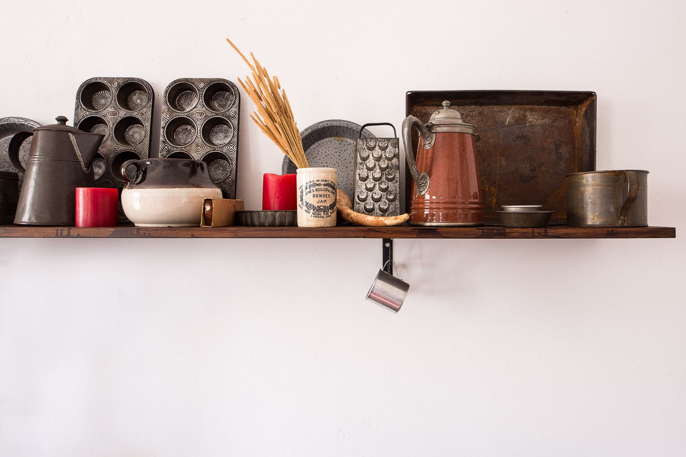
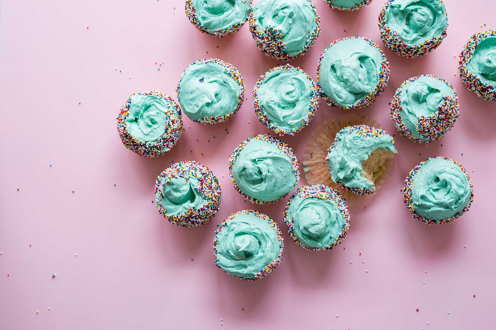
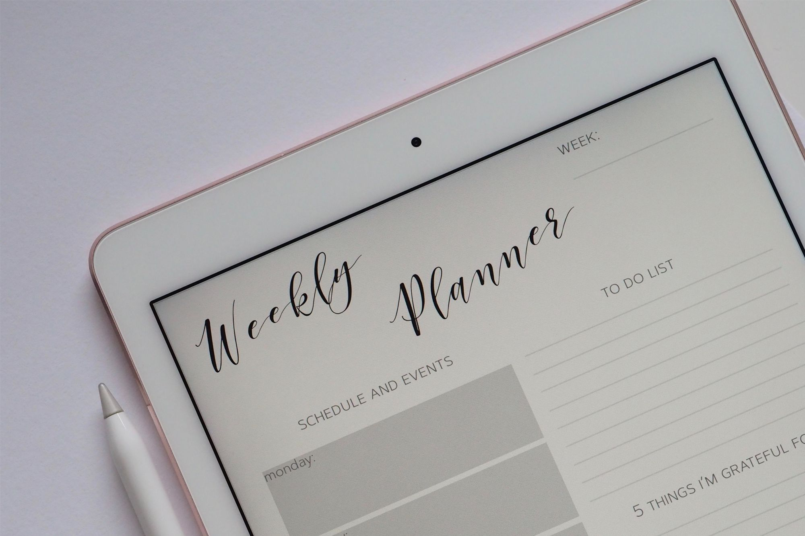

```{r child = "../style/setup.Rmd"}
```

```{r load-packages, message=FALSE, echo=FALSE}
library(countdown)
```

```{r include=FALSE}
hook_source <- knitr::knit_hooks$get('source')
knitr::knit_hooks$set(source = function(x, options) {
  x <- stringr::str_replace(x, "^[[:blank:]]?([^*].+?)[[:blank:]]*#<<[[:blank:]]*$", "*\\1")
  hook_source(x, options)
})
```

class: middle, inverse

background-image: url("img/press_play.png")
background-size: cover
background-color: #0F4C81

.pull-left-narrow[
  .larger[.embolden[.pink[
    class
    starts
    in...
  ]]]
]
```{r echo=FALSE}
countdown(minutes = 1, color_background = "white")
```


---

class: middle, inverse

## keep this link handy:
## https://djnavarro.link/robust-tools 

---

class: middle, inverse

## Scientific work is a little like baking

.pull-left[
```{r baking-tools, echo=FALSE}

```
]
.pull-right[
```{r baking-cupcakes, echo=FALSE}

```
]


---

class: middle, inverse

## We love the end product!

.pull-left[
- Cupcakes are tasty
- Cupcakes are fun
- Cupcakes are **awesome**
]
.pull-right[
```{r baking-cupcakes2, echo=FALSE}

```
]


---

class: middle, inverse

## We're not always excited about the process

.pull-left[
```{r baking-tools2, echo=FALSE}

```
]
.pull-right[
- Using the tools well is **work**
- Finding good recipes is **work**
- Expert bakers are intimidating
- Failures are demoralising
]


---

class: middle, inverse

## This "baking class" is about the tools

.pull-left[
```{r baking-tools3, echo=FALSE}

```
]
.pull-right[
Paired discussion `r emo::ji("women_with_bunny_ears")`
- Flesh out this analogy.
- What other parallels exist?
- How does it relate to you?
- Anxiety about the class?
- Etc.

```{r echo=FALSE}
countdown(minutes = 3)
```
]

---

class: inverse

.pull-left[
```{r kitchen-inrepair-small, echo=FALSE, out.height=250}
knitr::include_graphics("img/kitchen-inrepair.png")
```
.hand[How I used to teach R...]
- Install R. Install RStudio
- Install packages. Load them
- Waste a lot of time `r emo::ji("hourglass_flowing_sand")`
- Start with `10 + 20`
- Bore students to tears `r emo::ji("cry")`
]

--

.pull-right[
```{r kitchen-built-small, echo=FALSE, out.height=250}
knitr::include_graphics("img/kitchen-built.png")
```
.hand[How I now teach this:]
- Click on this LINK `r emo::ji("link")`
- Draw some pictures! `r emo::ji("art")`
- Start with fun `r emo::ji("woman_dancing")`
- The boring bits can wait...
]


---


class: middle

.pull-left-narrow[
  .huge-blue-number[1]
]
.pull-right-wide[
  .larger[
  yeah, that was a lie
  ]
]


---


class: middle

.pull-left-narrow[
  .huge-blue-number[1]
]
.pull-right-wide[
  .larger[
  let's talk about the class first
  ]
]

---

class: middle, inverse

## Class schedule

.pull-left[
```{r class-schedule-a, echo=FALSE}

```
]
.pull-right[
1. **Data visualisation**
2. **Working with data**
3. **Writing experiments**
4. **Keeping projects tidy**
5. .
6. **Archiving & version control**
7. **Documentation**
8. .
9. .
]


---

class: middle, inverse

## Class schedule

.pull-left[
```{r class-schedule-b, echo=FALSE}

```
]
.pull-right[
1. **Data visualisation**
2. **Working with data**
3. **Writing experiments**
4. **Keeping projects tidy**
5. .plainblack[.embolden[Project proposals]]
6. **Archiving & version control**
7. **Documentation**
8. .plainblack[.embolden[??????]]
9. .plainblack[.embolden[Student presentations]]
]


---

class: middle, inverse

## Assessment

.pull-left[
```{r class-assessment, echo=FALSE}
knitr::include_graphics("img/class-assessment.jpg")
```
]
.pull-right[
- Class participation: 20%
- Problem sets: 30%
- Student projects: 50%
]


---

class: middle, inverse

## Class participation (20%)

.pull-left[
```{r class-assessment-a, echo=FALSE}
knitr::include_graphics("img/class-assessment.jpg")
```
]
.pull-right[
- Best effort at the content
- Help others if you can
- Talk, in moderation
- Follow code of conduct
- Be kind (& have fun)
]


---

class: middle, inverse

## Problem sets (30%)

.pull-left[
```{r class-assessment-b, echo=FALSE}
knitr::include_graphics("img/class-assessment.jpg")
```
]
.pull-right[
- Three exercises `r emo::ji("bike")` `r emo::ji("swimming_man")` `r emo::ji("athletic_shoe")`
- Partly technical `r emo::ji("scream")`
- Partly written `r emo::ji("memo")`
- Exercises are small `r emo::ji("shrimp")`
- Practice versions first! `r emo::ji("slightly_smiling_face")`
]


---

class: middle, inverse

## Student projects (50%)

.pull-left[
```{r class-assessment-c, echo=FALSE}
knitr::include_graphics("img/class-assessment.jpg")
```
]
.pull-right[
- You get to choose!
- Discuss ideas with me `r emo::ji("slightly_smiling_face")`
- Doesn't need to be technical
- Proposals in week 5
- Presentations in week 9
- Final submission XXX
]


---

class: middle, inverse

## before we begin...
## what questions do you have? `r emo::ji("thinking")`


---


class: middle

.pull-left-narrow[
  .huge-blue-number[2]
]
.pull-right-wide[
  .larger[
  our online workspace
  ]
]


---

class: middle, inverse

## R + RStudio on my laptop

.pull-left[
```{r rstudio_local, echo=FALSE}
knitr::include_graphics("img/rstudio_local.png")
```
]
.pull-right[
- Download and install R
- Download and install RStudio
- Install a lot of other things
- Cry when something breaks
- Ready to go!
]

---

class: middle, inverse

## R + RStudio in the cloud

.pull-left[
```{r rstudio_cloud, echo=FALSE}
knitr::include_graphics("img/rstudio_cloud.png")
```
]
.pull-right[
- It's the same thing
- Sign up at: https://rstudio.cloud
- Ready to go!
]

