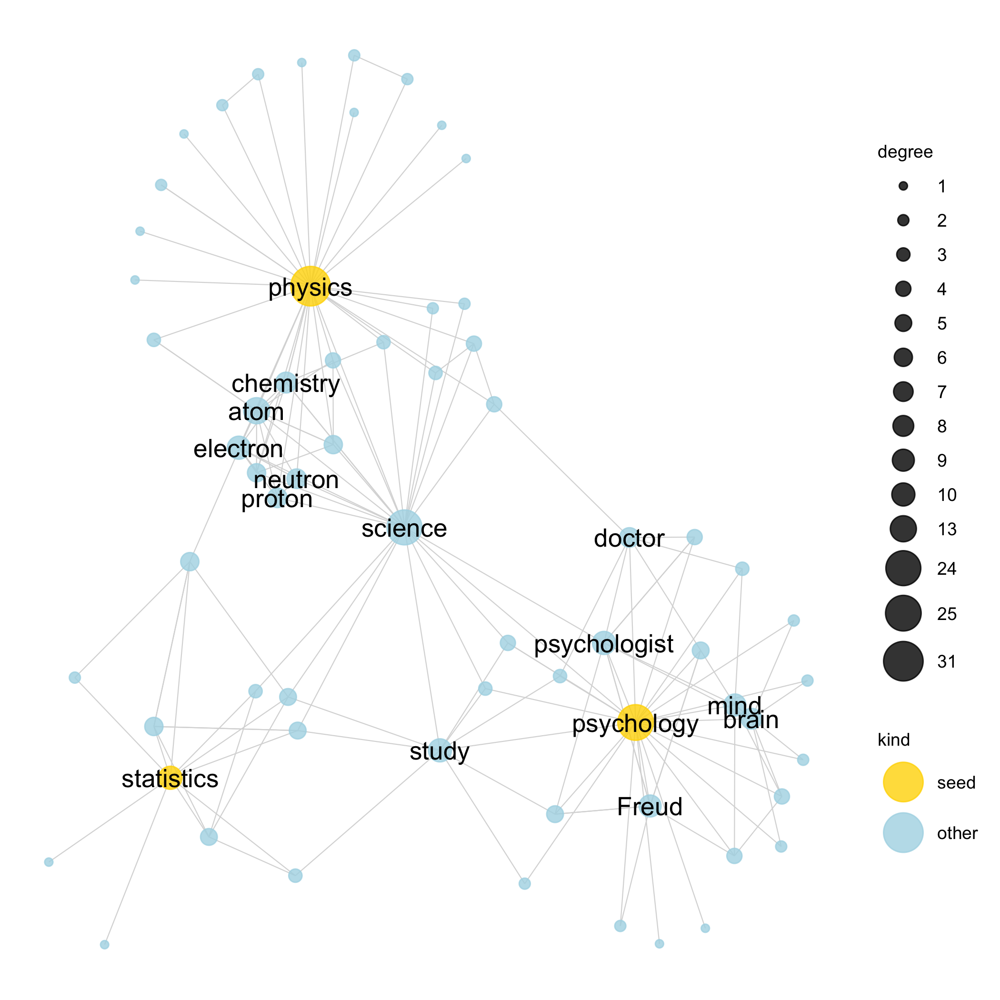

```{r child = "../style/setup.Rmd"}
```

```{r load-packages, message=FALSE, echo=FALSE}
library(countdown)
library(tidyverse)
```


```{r meta, echo=FALSE}
library(metathis)
meta() %>%
  meta_general(
    description = "An introduction to data wrangling in R using tidyverse tools, featuring data from the 'Small World of Words' study",
  ) %>% 
  meta_name("github-repo" = "djnavarro/robust-tools") %>% 
  meta_social(
    title = "A dance with data using dplyr",
    url = "https://robust-tools.djnavarro.net/dancing/",
    image = "https://robust-tools.djnavarro.net/dancing/img/filter_slide.png",
    image_alt = "Illustration of how the filter() function in the R package dplyr works, showing how to extract a small subset of the so-called 'Small World of Words' data set. The background image is tan, and on the left hand side shows filter coffee dripping downwards.",
    og_type = "website",
    og_author = "Danielle Navarro",
    twitter_card_type = "summary_large_image",
    twitter_creator = "@djnavarro"
  )
```


```{r include=FALSE}
hook_source <- knitr::knit_hooks$get('source')
knitr::knit_hooks$set(source = function(x, options) {
  x <- stringr::str_replace(x, "^[[:blank:]]?([^*].+?)[[:blank:]]*#<<[[:blank:]]*$", "*\\1")
  hook_source(x, options)
})

num_fmt <- scales::number_format(big.mark = ",")
```


class: middle, inverse

## https://rstudio.cloud/project/1006868

---

class: middle, inverse

background-image: url("img/swow_concreteness_fade.jpg")
background-size: cover

.pull-left-narrow[
  .huge-blue-number[1]
]
.pull-right-wide[
  .larger[.embolden[
  Small World of Words
  ]]
]


---

class:middle


background-image: url("img/swow_concreteness_strongfade.jpg")
background-size: cover


.pull-left[
```{r, echo=FALSE}

```
]

.pull-right[
<br><br>
De Deyne, Navarro, Perfors, Brysbaert & Storms (2019).
<br><br>
*The Small World of Words: English word association norms for over 12,000 cue words* <br><br>
https://psyarxiv.com/mb93p/ <br>
https://smallworldofwords.org/
]


---

class: inverse

background-image: url("img/swow_concreteness_strongfade.jpg")
background-size: cover


.hand[Import the SWOW data]
--
```{r read-swow, warning=FALSE, message=FALSE, results='hide'}
library(tidyverse)
swow <- read_tsv(file = "data_swow.csv.zip")
swow <- swow %>% mutate(id = 1:n()) # <- ignore for now
```
--
```{r read-swow2, echo=FALSE, warning=FALSE, highlight.output=2}
print(swow, n = 5)
```


---

class: inverse

background-image: url("img/swow_concreteness_strongfade.jpg")
background-size: cover

.hand[Automated name cleaning?]
--
```{r clean-names, warning=FALSE, message=FALSE, results='hide'}
library(janitor)
swow <- clean_names(swow)
```
--
```{r clean-names2, echo=FALSE, warning=FALSE, highlight.output=2}
print(swow, n = 5)
```

---

class: inverse

background-image: url("img/swow_concreteness_strongfade.jpg")
background-size: cover

.hand[Manual name cleaning]
--
```{r renaming, warning=FALSE, message=FALSE, results='hide'}
swow <- swow %>%
  rename(n_response = r1, 
         n_total = n, 
         strength = r1_strength)
```
--
```{r renaming2, echo=FALSE, warning=FALSE, highlight.output=2}
print(swow, n = 3)
```


---

class: inverse, middle

background-image: url("img/swow_concreteness_strongfade.jpg")
background-size: cover

.hand[<span style="font-size:60pt">exercise #1</span>]

- open `exercise_dplyr_01.R`
- write your comments at the beginning
- load tidyverse
- load the swow data
- use `rename()` to get new variable names


---


class: middle, inverse

background-image: url("img/filter.jpg")
background-size: cover

.pull-left-narrow[
  .huge-blue-number[2]
]
.pull-right-wide[
  .larger[.embolden[
  Filtering Data
  ]]
]


---

background-image: url("img/filter_fade.jpg")
background-size: cover

.hand[Filter to keep a subset of the data]

- The SWOW data has `r num_fmt(nrow(swow))` rows
- Let's extract the cases when `cue == "woman"`

---

background-image: url("img/filter_fade.jpg")
background-size: cover

.hand[Filter to keep a subset of the data]

--
```{r filter1, warning=FALSE, message=FALSE, results='hide'}
swow %>%
  filter(cue == "woman")
```
--
```{r filter2, echo=FALSE, warning=FALSE}
swow %>%
  filter(cue == "woman") %>%
  print(n = 4)
```


---

background-image: url("img/filter_fade.jpg")
background-size: cover

.hand[Filter to keep a subset of the data]

.pull-left[
```{r filter3, warning=FALSE, message=FALSE, results='hide', fig.show='hide'}
woman_fwd <- swow %>%
  filter(cue == "woman")

ggplot(woman_fwd) + 
  geom_col(aes(
    x = response, 
    y = strength
  ))
```
]
--
.pull-right[
```{r ref.label="filter3", echo=FALSE}
```
]

---

background-image: url("img/filter_fade.jpg")
background-size: cover

.hand[Filter to keep a subset of the data]

.pull-left[
```{r filter4, warning=FALSE, message=FALSE, results='hide', fig.show='hide'}
woman_fwd <- swow %>%
  filter(cue == "woman")

ggplot(woman_fwd) + 
  geom_col(aes(
    x = response, 
    y = strength
  )) + 
  coord_flip()
```
]

.pull-right[
```{r ref.label="filter4", echo=FALSE}
```
]


---

background-image: url("img/filter_fade.jpg")
background-size: cover

.hand[One filter(), then another filter()]

.pull-left[
```{r filter5, warning=FALSE, message=FALSE, results='hide', fig.show='hide'}
woman_fwd <- swow %>%
 filter(cue == "woman") %>%
 filter(n_response > 1)

ggplot(woman_fwd) + 
  geom_col(aes(
    x = response, 
    y = strength
  )) + 
  coord_flip()
```
]

.pull-right[
```{r ref.label="filter5", echo=FALSE}
```
]

---

background-image: url("img/filter_fade.jpg")
background-size: cover

.hand[Two expressions in one filter()]

.pull-left[
```{r filter6, warning=FALSE, message=FALSE, results='hide', fig.show='hide'}
woman_fwd <- swow %>%
  filter(
    cue == "woman",
    n_response > 1
  )

ggplot(woman_fwd) + 
  geom_col(aes(
    x = response, 
    y = strength
  )) + 
  coord_flip()
```
]

.pull-right[
```{r ref.label="filter6", echo=FALSE}
```
]


---

class: inverse, middle

background-image: url("img/filter_fade.jpg")
background-size: cover

.hand[<span style="font-size:60pt">exercise #2</span>]

- open `exercise_dplyr_02.R`
- create `woman_bck` for "backward associates"
  - i.e. when `"woman"` is the `response`
  - only keep cases with at least two responses


---


class: middle, inverse

background-image: url("img/arrange_dark.jpg")
background-size: cover

.pull-left-narrow[
  .huge-blue-number[3]
]
.pull-right-wide[
  <br>
  .larger[.embolden[.plainwhite[
    Data Arranging
  ]]]
]


---

background-image: url("img/arrange_fade.jpg")
background-size: cover

.hand[The forward data are arranged neatly]

```{r arrange1, warning=FALSE, message=FALSE, results='hide', fig.show='hide'}
swow %>%
  filter(cue == "woman", n_response > 1)
```
```{r arrange1-print, echo=FALSE}
swow %>%
  filter(cue == "woman", n_response > 1) %>%
  print(n = 6)
```


---

background-image: url("img/arrange_fade.jpg")
background-size: cover

.hand[The backward data are not]

```{r arrange2, warning=FALSE, message=FALSE, results='hide', fig.show='hide'}
swow %>%
  filter(response == "woman", n_response > 1)
```
```{r arrange2-print, echo=FALSE}
swow %>%
  filter(response == "woman", n_response > 1) %>%
  print(n = 6)
```


---

background-image: url("img/arrange_fade.jpg")
background-size: cover

.hand[Lets arrange() them]

```{r arrange3, warning=FALSE, message=FALSE, results='hide', fig.show='hide'}
swow %>%
  filter(response == "woman", n_response > 1) %>%
  arrange(strength)
```
--
```{r arrange3-print, echo=FALSE}
swow %>%
  filter(response == "woman", n_response > 1) %>%
  arrange(strength) %>%
  print(n = 5)
```


---

background-image: url("img/arrange_fade.jpg")
background-size: cover

.hand[Lets arrange() them, in descending order]

```{r arrange4, warning=FALSE, message=FALSE, results='hide', fig.show='hide'}
swow %>%
  filter(response == "woman", n_response > 1) %>%
  arrange(desc(strength))
```

```{r arrange4-print, echo=FALSE}
swow %>%
  filter(response == "woman", n_response > 1) %>%
  arrange(desc(strength)) %>%
  print(n = 5)
```


---

class: inverse, middle

background-image: url("img/arrange_fade.jpg")
background-size: cover

.hand[<span style="font-size:60pt">exercise #3</span>]

- open script `exercise_dplyr_03.R`
- create analogous data sets `man_fwd` and `man_bck`
- make sure all data sets are arranged by descending `strength`

---

class: middle, inverse

background-image: url("img/select_dark.jpg")
background-size: cover

.pull-left-narrow[
  .huge-blue-number[4]
]
.pull-right-wide[
  <br>
  .larger[.embolden[.plainwhite[
    &nbsp;&nbsp;Variable<br>&nbsp;&nbsp;Selection
  ]]]
]

---

background-image: url("img/select_fade.jpg")
background-size: cover

.hand[Select cue, response and strength]

```{r select1, warning=FALSE, message=FALSE, results='hide', fig.show='hide'}
swow %>%
  filter(response == "woman", n_response > 1) %>%
  arrange(desc(strength)) %>%
  select(cue, response, strength) #<<
```

--

```{r select1-print, echo=FALSE}
swow %>%
  filter(response == "woman", n_response > 1) %>%
  arrange(desc(strength)) %>%
  select(cue, response, strength) %>%
  print(n = 3)
```


---

background-image: url("img/select_fade.jpg")
background-size: cover

.hand[Alternative approach...]


```{r select2, warning=FALSE, message=FALSE, results='hide', fig.show='hide'}
swow %>%
  filter(response == "woman", n_response > 1) %>%
  arrange(desc(strength)) %>%
  select(-n_response, -n_total) #<<
```

--

```{r select2-print, echo=FALSE}
swow %>%
  filter(response == "woman", n_response > 1) %>%
  arrange(desc(strength)) %>%
  select(-n_response, -n_total) %>%
  print(n = 3)
```


---

class: inverse, middle

background-image: url("img/select_fade.jpg")
background-size: cover

.hand[<span style="font-size:60pt">exercise #4</span>]

- open script `exercise_dplyr_04.R`
- notice that the `woman_fwd` pipeline uses `select()` 
- use `select()` for the other variables

---

class: middle, inverse

background-image: url("img/butterfly.jpg")
background-size: cover

.pull-left-narrow[
  .huge-blue-number[5]
]
.pull-right-wide[
  <br>
  .larger[.embolden[
    &nbsp;&nbsp;Mutate
  ]]
]


---

background-image: url("img/butterfly_fade.jpg")
background-size: cover

.hand[Digression: Psychological measurement is hard]


```{r mutate0, warning=FALSE, message=FALSE, echo=FALSE, out.height=400, out.width=600}
# extractor function
get_associates <- function(data, word, by, thresh = 1) {
  data %>%
    filter({{by}} == word, n_response > thresh) %>%
    arrange(desc(strength)) %>%
    mutate(
      rank = rank(-strength),
      word = word, 
      type = deparse(rlang::enexpr(by)) %>% 
        fct_recode("forward" = "cue", "backward" = "response"),
      associate = if_else(type == "forward", true = response, false = cue)
      ) %>%
    select(cue, response, strength, id, rank, type, word, associate)
}

# four data sets
woman_fwd <- get_associates(data = swow, word = "woman", by = cue)
woman_bck <- get_associates(data = swow, word = "woman", by = response)
man_fwd <- get_associates(data = swow, word = "man", by = cue)
man_bck <- get_associates(data = swow, word = "man", by = response)

# bind
gender <- bind_rows(
  woman_fwd, woman_bck, man_fwd, man_bck
)


# remove added variables to avoid later confusion
woman_fwd <- woman_fwd %>% select(cue, response, strength, id)
woman_bck <- woman_bck %>% select(cue, response, strength, id)
man_fwd <- man_fwd %>% select(cue, response, strength, id)
man_bck <- man_bck %>% select(cue, response, strength, id)

# plot
ggplot(gender) + 
  geom_histogram(aes(x = strength)) + 
  facet_grid(vars(word), vars(type)) + 
  scale_y_log10() + 
  xlab("associative strength") + 
  ylab("frequency (logarithmic scale)") + 
  coord_cartesian(xlim = c(0, .25))
```


---

background-image: url("img/butterfly_fade.jpg")
background-size: cover

.hand[Forward: compete with responses to **same** cue]

```{r mutate1, results="hide"}
woman_fwd
```

```{r mutate1-print, echo=FALSE}
woman_fwd %>% print(n = 6)
```


---


background-image: url("img/butterfly_fade.jpg")
background-size: cover

.hand[Backward: compete with responses to **other** cues]

```{r mutate2, results="hide"}
woman_bck
```

```{r mutate2-print, echo=FALSE}
woman_bck %>% print(n = 6)
```

---


background-image: url("img/butterfly_fade.jpg")
background-size: cover

.hand[Use mutate() to compute new variables]

```{r mutate3, results="hide"}
woman_fwd %>%
  mutate(rank = rank(-strength))
```

```{r mutate3-print, echo=FALSE}
woman_fwd %>%
  mutate(rank = rank(-strength)) %>%
  print(n = 5)
```


---


background-image: url("img/butterfly_fade.jpg")
background-size: cover

.hand[Use mutate() to compute new variables]

```{r mutate4, results="hide"}
woman_bck %>%
  mutate(rank = rank(-strength))
```

```{r mutate4-print, echo=FALSE}
woman_bck %>%
  mutate(rank = rank(-strength)) %>%
  print(n = 5)
```


---


background-image: url("img/butterfly_fade.jpg")
background-size: cover

.hand[Use mutate() to compute new variables]

```{r mutate5, results="hide"}
woman_bck %>%
  mutate(rank = rank(-strength), type = "backward")
```

```{r mutate5-print, echo=FALSE}
woman_bck %>%
  mutate(rank = rank(-strength), type = "backward") %>%
  print(n = 5)
```


---


background-image: url("img/butterfly_fade.jpg")
background-size: cover

.hand[Which should we use, "rank" or "strength"?]

```{r mutate6, echo=FALSE, out.height=400, out.width=600}
ggplot(
  data = bind_rows(
    woman_fwd %>% mutate(rank = rank(-strength), type = "forward"),
    woman_bck %>% mutate(rank = rank(-strength), type = "backward")
  ) %>%
    filter(rank <= 20)
) + 
  geom_point(aes(x = rank, y = strength)) + 
  geom_path(aes(x = rank, y = strength)) + 
  facet_wrap(vars(type))
```

---


class: inverse, middle

background-image: url("img/butterfly_fade.jpg")
background-size: cover

.hand[<span style="font-size:60pt">exercise #5</span>]

- open script `exercise_dplyr_05.R`
- mutate the data sets to include four new variables:
  - `rank`: see the slides
  - `type`: either `forward` or `backward` 
  - `word`: either `man` or `woman`
  - `associate`: see script for details!


---

class: middle, inverse

background-image: url("img/bind.jpg")
background-size: cover

.pull-left-narrow[
  .huge-blue-number[6]
]
.pull-right-wide[
  <br>
  .larger[.embolden[.plainwhite[
    &nbsp;&nbsp;Bind
  ]]]
]


---


background-image: url("img/bind_fade.jpg")
background-size: cover

.hand[Use bind_rows() to stack data sets vertically]

```{r echo=FALSE, warning=FALSE}
woman_fwd <- get_associates(data = swow, word = "woman", by = cue)
woman_bck <- get_associates(data = swow, word = "woman", by = response)
man_fwd <- get_associates(data = swow, word = "man", by = cue)
man_bck <- get_associates(data = swow, word = "man", by = response)
```


```{r bind1, results="hide", warning=FALSE}
gender <- bind_rows(woman_fwd, woman_bck, 
                    man_fwd, man_bck)
```

--

```{r bind1-print, echo=FALSE, highlight.output = 1, warning=FALSE}
gender <- bind_rows(woman_fwd, woman_bck, 
                    man_fwd, man_bck)
print(gender, n = 6)
```


---


background-image: url("img/bind_fade.jpg")
background-size: cover

.hand[Clean up using select()...]


```{r bind2, results="hide", warning=FALSE}
gender <- bind_rows(woman_fwd, woman_bck, 
                    man_fwd, man_bck) %>%
  select(id:associate)
```

```{r, echo=FALSE}
print(gender, n = 5)
```

---


background-image: url("img/bind_fade.jpg")
background-size: cover

.hand[Clean up using select() and filter()]


```{r bind3, results="hide", warning=FALSE}
gender <- bind_rows(woman_fwd, woman_bck, 
                    man_fwd, man_bck) %>%
  select(id:associate) %>%
  filter(associate != "man", associate != "woman")
```

```{r, echo=FALSE}
print(gender, n = 4)
```


---


background-image: url("img/bind_fade.jpg")
background-size: cover

.hand[Check that it worked!]

.pull-left[
```{r bind4, results='hide'}
gender %>%
  group_by(word, type) %>%
  count()
```
]
--
.pull-right[
```{r ref.label="bind4", echo = FALSE}
```
]


---


class: inverse, middle

background-image: url("img/bind_fade.jpg")
background-size: cover

.hand[<span style="font-size:60pt">exercise #6</span>]

- open script `exercise_dplyr_06.R`
- take a look at the instructions! `r emo::ji("slightly_smiling_face")`


---

class: middle, inverse

background-image: url("img/pivot.jpg")
background-size: cover

.pull-left-narrow[
  .huge-blue-number[7]
]
.pull-right-wide[
  <br>
  .larger[.embolden[.plainwhite[
    &nbsp;&nbsp;Pivot
  ]]]
]

---

background-image: url("img/pivot_fade.jpg")
background-size: cover

.hand[Lovely data]

.pull-left[
```{r pivot0, message=FALSE}
love <- read_csv(
  "data_love.csv"
)
```
]

--

.pull-right[
```{r, echo=FALSE}
love
```
]


---

background-image: url("img/pivot_fade.jpg")
background-size: cover

.hand["Pivot" to "longer" data...]

.pull-left[
```{r pivot1, message=FALSE}
long_love <- love %>%
  pivot_longer(
    cols = c(heart, book),
    names_to = "object",
    values_to = "emoji"
  )
```
]

--

.pull-right[
```{r, echo=FALSE}
long_love
```
]


---

background-image: url("img/pivot_fade.jpg")
background-size: cover

.hand["Pivot" to "wider" data...]

.pull-left[
```{r pivot2, message=FALSE}
wide_love <- long_love %>%
  pivot_wider(
    id_cols = colour,
    names_from = object,
    values_from = emoji
  )
```
]

--

.pull-right[
```{r, echo=FALSE}
wide_love
```
]


---

background-image: url("img/pivot_fade.jpg")
background-size: cover

.pull-left[
.hand[Reshape the data]
```{r pivot3, results="hide"}
gender_fwd <- gender %>% 
  filter(
    type == "forward"
  ) %>% 
  pivot_wider(
    id_cols = associate, 
    names_from = word, 
    values_from = rank
  )
```
]

--

.pull-right[
```{r, echo=FALSE}
gender_fwd
```
]


---

background-image: url("img/pivot_fade.jpg")
background-size: cover

.pull-left-wide[
.hand[Reshape the data]
```{r pivot4, results="hide"}
gender_fwd <- gender_fwd %>% 
  mutate(
    woman = replace_na(1/woman, 0),
    man = replace_na(1/man, 0), 
    diff = woman - man
  )  %>%  
  arrange(diff) 
```
]


---

background-image: url("img/pivot_fade.jpg")
background-size: cover

.pull-right-wide[
```{r, echo=FALSE}
gender_fwd
```
]


---

background-image: url("img/pivot_fade.jpg")
background-size: cover

.hand[Reshape the data]
.pull-left[
```{r pivot5, results="hide", fig.show="hide"}
ggplot(
  data = gender_fwd,
  mapping = aes(
    x = associate %>% 
      reorder(diff), 
    y = diff
  )) + 
  geom_col() + 
  coord_flip()
```
]

.pull-right[
```{r ref.label="pivot5", echo=FALSE}
```
]


---

background-image: url("img/pivot_fade.jpg")
background-size: cover

```{r ref.label="pivot5", echo=FALSE}
```


---


class: inverse, middle

background-image: url("img/pivot_fade.jpg")
background-size: cover

.pull-left-narrow[
  <br><br><br>
  .hand[<span style="font-size:40pt">exercise #7</span>]
]

.pull-right-wide[
```{r, echo=FALSE, fig.height = 4, fig.width = 4, out.height=600}
gender_bck <- gender %>% 
  filter(type == "backward") %>% 
  pivot_wider(
    id_cols = associate, 
    names_from = word, 
    values_from = rank
  ) %>% 
  mutate(
    woman = replace_na(1/woman, 0),
    man = replace_na(1/man, 0), 
    diff = woman - man
  ) %>%
  arrange(diff) %>%
  filter(abs(diff) > .05)

ggplot(gender_bck) + 
  geom_col(aes(x = associate %>% reorder(diff), y = diff)) + 
  coord_flip() + 
  ylab(NULL) + 
  xlab(NULL)
```
]

---

class: middle, inverse

background-image: url("img/join_dark.jpg")
background-size: cover

.pull-left-narrow[
  .huge-blue-number[8]
]
.pull-right-wide[
  <br>
  .larger[.embolden[.plainwhite[
    &nbsp;&nbsp;Join
  ]]]
]


---

class: middle, inverse

background-image: url("img/join_fade.jpg")
background-size: cover

.hand[Restore all the variables?]

```{r}
gender
```


---

class: middle, inverse

background-image: url("img/join_fade.jpg")
background-size: cover

.hand[Restore all the variables?]

```{r}
gender %>%
  left_join(swow, by = "id")
```

---


class: middle, inverse

background-image: url("img/snow_road2.jpg")
background-size: cover

.pull-right-wide[
<br>
.hand[Want more information?]

R for Data Science has a lot of this<br>
https://r4ds.had.co.nz

<br><br>

Stat 545 is a wonderful resource<br>
https://stat545.com/
]


